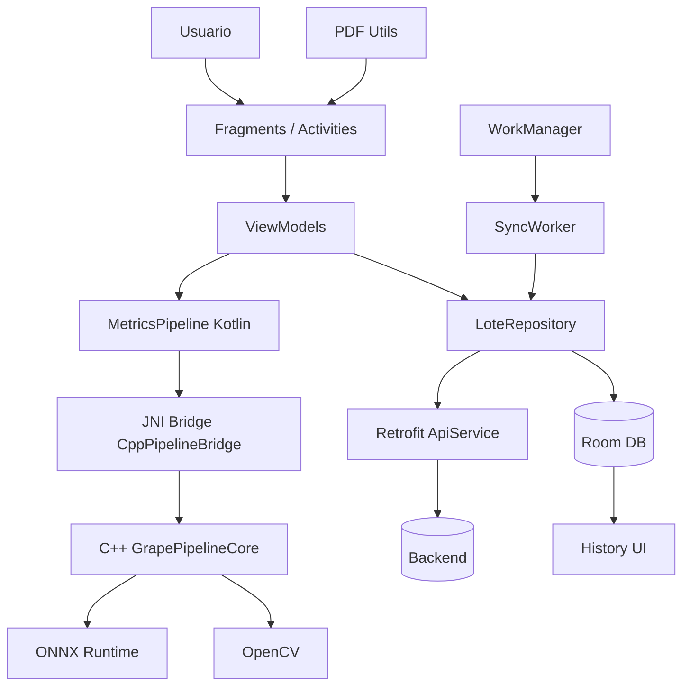
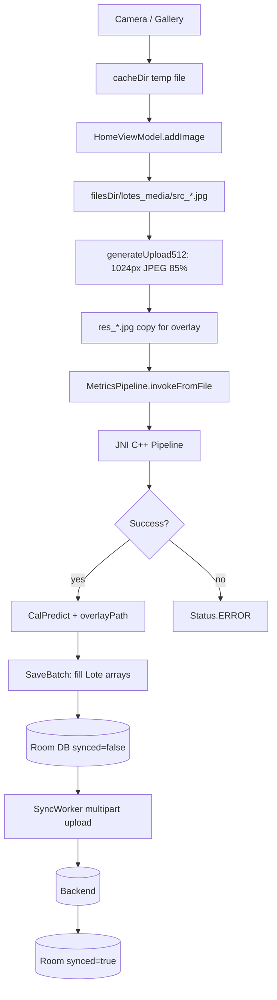
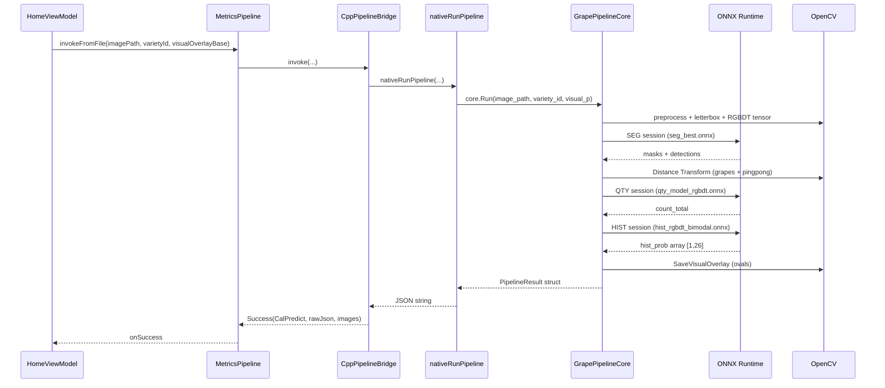
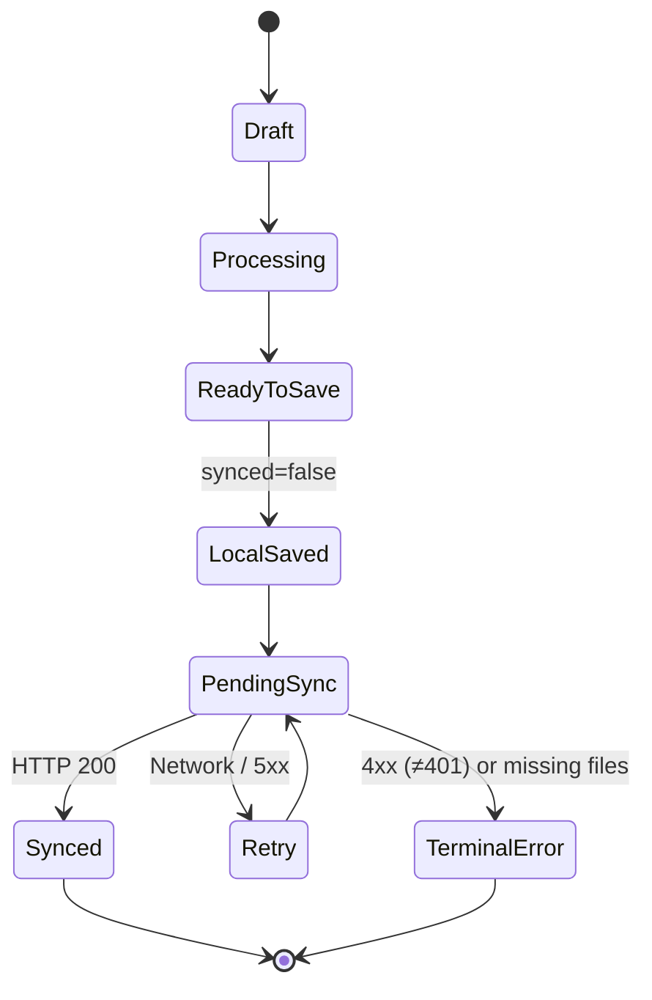

# Metrics Detection Android — Intelligence Viticulture Platform

[]()
[]()
[]()
[]()
[]()
[]()
[]()
[]()

---

## 1. Overview

**Metrics Detection** is an industrial-grade mobile platform for digital vineyard quality control via **Edge AI**. Designed for field operation, it counts grape berries, estimates calibre distribution, generates segmentation overlay evidence, and synchronises results to the cloud — all processed locally on the device.

**Key identifiers:**
- **Package:** `com.gaiaspa.metrics_detection`
- **Language:** Kotlin 1.9.x (Android) + C++17 (native JNI)
- **Architecture:** MVVM, offline-first, Room + Retrofit + WorkManager
- **AI Engine:** ONNX Runtime 1.24.3 via JNI, OpenCV 4.x

**Key features:**
- Single-image inference with segmentation + regression
- Multi-View Fusion V1 (A/B pair per bunch)
- Batch forensic processing (offline, data-only)
- PDF report generation with histograms
- Cloud sync with JWT authentication and AES-256 token storage

| Task | Traditional Process | Metrics Detection (AI) | Benefit |
|:---|:---|:---|:---|
| Counting Time | 5–10 min per bunch | < 1 s (Pure AI) | ~98% reduction |
| Human Error | High (fatigue) | Low (standardised) | Consistent reporting |
| Digital Evidence | None (paper) | Full overlay + photo | 100% traceability |
| Data Sync | Manual (end of day) | Automatic (real-time) | Instant decisions |
| History | Hard to track | Cloud database | Historical analytics |

| Metric | Impact |
|:---|---:|
| Audit Time Reduction | 80% |
| Offline Operation | 100% |
| Data Traceability | 100% |

**Accuracy by variety (field-tested):**

| Variety | Fidelity |
|:---|---:|
| Thompson | ~94.4% |
| Sweet Globe | ~94.1% |
| Crimson | ~93.7% |
| Ivory | ~86.2% |

**Performance benchmarks:**

| Scenario | Resolution | Avg Latency | P95 | Memory Peak |
|:---|:---|:---|:---|:---|
| Pure AI | 512x512 | < 1 s | ~1.1 s | ~180 MB |
| Full Pipeline | 1024x1024 | ~2.4 s | ~3.5 s | ~450 MB |

---

## 2. Architecture



### Layer Descriptions

**UI Layer:** Fragments with ViewBinding bound by the Android Navigation component. Key screens:
- `HomeFragment` → `Step1Fragment` (image capture) → `Step2Fragment` (review & save)
- `HistoryFragment` (paginated lote list) → `HistoryDetailFragment` (per-lote detail)
- `ProfileFragment`, `SupportFragment`, `FullscreenImageFragment`, `ProgressDialogFragment`
- `LoginActivity`, `RegisterActivity`, `RecoveryActivity` (auth)
- `MainActivity` hosts bottom navigation; `LauncherActivity` routes auth vs. main

**ViewModel Layer:**
- `HomeViewModel` — orchestrates capture, inference, and save; holds `LiveData` of predictions and UI state
- `HistoryViewModel` — handles pagination, multi-select, cloud download triggers

**Repository Layer:**
- `LoteRepository` — singleton bridging Room (local) and Retrofit (remote); encapsulates insert, sync, delete, download logic
- `ProfileRepository` — user profile and auth state management

**Persistence (Room):**
- `AppDatabase` v12 — `fallbackToDestructiveMigration`, entities: `Lote`, `Profile`
- `LoteDao` — CRUD + `getNotSynced`, `getByUserId` queries
- `ProfileDao` — user profile storage
- `Converters` — Gson serialisation for `List<CalPredict>` and `List<String>` columns

**Background (WorkManager):**
- `SyncWorker` — iterates unsynced lotes, validates physical files, uploads multipart with error classification
- `SyncManager` — schedules periodic (15 min) + manual one-shot sync; requires `NetworkType.CONNECTED`
- `BatchDownloadWorker` — downloads lotes + images from cloud with `Semaphore(4)` concurrency

**Network (Retrofit + OkHttp):**
- `ApiService` — Retrofit interface declaring all auth and batch endpoints
- `ApiClient` — singleton Retrofit builder with Gson converter and OkHttp client
- `AuthInterceptor` — injects `Authorization: Bearer <token>` on all requests except `/auth/login`, `/auth/refresh-token`
- `TokenAuthenticator` — intercepts HTTP 401, refreshes tokens synchronously, retries the original request

**Auth (Security):**
- `TokenProvider` — `EncryptedSharedPreferences` (AES-256 GCM) backed by `MasterKey`; stores access/refresh tokens, userId, companyId, role
- JWT-based authentication flowing through `AuthInterceptor` → `TokenAuthenticator`

**Native (JNI / C++):**
- `CppPipelineBridge` (Kotlin) → `nativeRunPipeline` (JNI entry in `grape_pipeline_jni.cpp`) → `GrapePipelineCore` (C++) → ONNX Runtime + OpenCV
- Models loaded on app startup from APK assets → `filesDir/weights/` (atomic temp-file + rename)

**ML Pipeline (Kotlin):**
- `MetricsPipeline` — validates model files, delegates to JNI bridge, parses JSON → `Success`
- `RuntimeVarietyCatalog` — maps variety names to integer IDs consumed by native code

**PDF:**
- `createLotesReportPdf` — multi-page report with cover page + per-lote detail cards
- `drawModernHistogram` — styled bar chart rendered on `Canvas`

---

## 3. Technology Stack

| Layer | Technology | Version |
|---|---|---|
| Language (Android) | Kotlin | 1.9.x |
| Language (Native) | C++17 via JNI | NDK 26+ |
| UI | ViewBinding, Fragments, Navigation, MPAndroidChart | AndroidX |
| Architecture | MVVM, AndroidViewModel, LiveData | AndroidX |
| Image Loading | Glide | 4.15.1 |
| Persistence | Room | 2.5.2 |
| Background | WorkManager | 2.7.1 |
| Network | Retrofit / OkHttp | 2.9.0 / 4.9.1 |
| Security | EncryptedSharedPreferences (AES-256) | security-crypto-ktx 1.1.0-alpha03 |
| Inference | ONNX Runtime (C++ API) | 1.24.3 |
| Vision | OpenCV Android SDK | 4.x |
| JSON | Gson | 2.9.0 |
| Charts | MPAndroidChart | — |
| Coroutines | Kotlinx Coroutines | 1.7.3 |
| PDF | android.graphics.pdf.PdfDocument | API 28+ |
| Build | CMake | 3.22.1 |

---

## 4. Project Structure

```
app/src/main/java/com/gaiaspa/metrics_detection/
├── auth/                          # LoginActivity, RegisterActivity, RecoveryActivity
├── BatchProcessor.kt              # Forensic batch processor (offline, data-only)
├── DebugBatchActivity.kt          # Debug/ADB activity for batch processing
├── FeatureFlags.kt                # Compile-time feature toggles
├── i18n/                          # LanguagePreferenceManager (ES/EN, WIP)
├── LauncherActivity.kt            # Entry point: routes to LoginActivity or MainActivity
├── MainActivity.kt                # Bottom navigation host (Home, History, Profile, Support)
├── MetricsDetectionApp.kt         # Application class; extracts ONNX models on startup
├── data/
│   ├── local/                     # Room: AppDatabase, LoteDao, ProfileDao, Converter, Migration, DatabaseProvider
│   ├── model/                     # Lote (Room entity), CalPredict, FusionEngine, FusionMetadata, LoteExtensions, request/response DTOs
│   └── repository/                # LoteRepository (local+remote bridge), ProfileRepository
├── ml/                            # MetricsPipeline, CppPipelineBridge, Success, ImageUtils, RuntimeVarietyCatalog
│                                  # Legacy: SingleDrawer, TwoHeadV6NbInfer, ScratchBuffers, Scaler, Scalers, SegmentationResult
│                                  # Utilities: utils_opencv_mask, utils_opencv_stadistics, utils_elipse, utils_midas, opencvUtils
├── network/                       # ApiService, ApiClient, TokenProvider, AuthInterceptor, TokenAuthenticator
├── pdf_utils/                     # createPDF, drawModernHistogram
├── ui/
│   ├── home/                      # HomeFragment, Step1Fragment, Step2Fragment, HomeViewModel
│   │                              # ImagePredictionAdapter, RacimoUiModel, RacimoFusionMapper
│   ├── history/                   # HistoryFragment, HistoryDetailFragment, HistoryViewModel
│   │                              # LoteHistoryAdapter, LoteDetailAdapter, LoteRepresentativeImage
│   ├── profile/                   # ProfileFragment, ProfileViewModel
│   ├── support/                   # SupportFragment
│   └── utils/                     # FullscreenImageFragment, ProgressDialogFragment
├── worker/                        # SyncWorker, SyncManager, BatchDownloadWorker
├── utils/                         # NetworkUtils, OrientationLiveData, Utils
└── utils.kt

app/src/main/cpp/
├── CMakeLists.txt
├── grape_pipeline_jni.cpp         # JNI entrypoint for nativeRunPipeline / nativeRelease
├── jni/                           # (placeholder)
├── include/                       # C++ headers
│   ├── grape_pipeline_config.hpp
│   ├── grape_pipeline_core.hpp    # GrapePipelineCore class
│   ├── grape_pipeline_onnx.hpp
│   ├── grape_pipeline_postprocess.hpp
│   ├── grape_pipeline_preprocess.hpp
│   └── grape_pipeline_types.hpp   # All structs: PipelineResult, PipelineInputs, SegmentationOutput, etc.
└── src/                           # C++ implementations
    ├── grape_pipeline_core.cpp    # Main Run() method: segmentation → QTY → HIST → overlay
    ├── grape_pipeline_onnx.cpp
    ├── grape_pipeline_postprocess.cpp
    └── grape_pipeline_preprocess.cpp

app/src/main/assets/
└── weights/modelos/
    ├── legacy/seg_best.onnx
    ├── qty_model_rgbdt.onnx
    └── hist_rgbdt_bimodal.onnx
```

---

## 5. Image Lifecycle



**Step-by-step:**
1. **Capture:** Camera via `TakePicture` or Gallery via `GetContent` → temp file in `cacheDir`
2. **Ingest:** `HomeViewModel.addImage` copies to `filesDir/lotes_media/src_*.jpg`
3. **Upload gen:** `ImageUtils.generateUpload512` produces `upload_512_*.jpg` (1024 px long edge, 85% JPEG)
4. **Overlay base:** A copy named `res_*.jpg` is created from the upload file to serve as overlay canvas
5. **Inference:** `MetricsPipeline.invokeFromFile` → `CppPipelineBridge.invoke` → `nativeRunPipeline` with `visualOverlayPath=res_*.jpg`
6. **Native overlay:** C++ pipeline draws elliptical outlines directly on `res_*.jpg` via `SaveVisualOverlay`
7. **Result:** `Success` object with `CalPredict` (qty, mean, mode, std, pred, bins) + overlay bitmap
8. **Batch save:** Fills `sourceImages`, `normalizedImages`, `uploadImages`, `overlayImages`, `calPredicts`
9. **Room:** `LoteRepository.insertLocalLote()` persists with `synced=false`
10. **Sync:** `SyncManager.enqueueManualSync()` → `SyncWorker` uploads to cloud; marks `synced=true`
11. **Display:** UI uses `Lote.images` computed property: `overlayImages` > `uploadImages` > `normalizedImages` > `sourceImages`
12. **PDF:** Uses overlay images if available; falls back through the same chain

---

## 6. ML Pipeline Deep Dive



### Pipeline Stages

**1. Preprocess (C++):**
- Letterbox resize to 512x512 (preserving aspect ratio)
- Normalise RGB channels
- Run `seg_best.onnx` (YOLOv8-seg) for instance segmentation
- Extract grape and pingpong instance masks
- Compute Distance Transforms: `GrapeDT` (distance to nearest grape centre) + `ReferenceDT` (distance to nearest pingpong/calibration object)

**2. RGBDT Tensor (5-channel input):**
- Shape: `[1, 5, 512, 512]`
- Channel 1–3: Normalised RGB
- Channel 4: Grape Distance Transform
- Channel 5: Reference (pingpong) Distance Transform

**3. QTY Model (`qty_model_rgbdt.onnx`):**
- Inputs: `x[1,5,512,512]`, `variety_idx[1]`, `seg_count_base[1]`
- Output: `count_total[1]` — estimated total berry count per image
- Gate: if `seg_count_base < 2`, QTY and HIST are skipped (not enough berries detected)

**4. HIST Model (`hist_rgbdt_bimodal.onnx`):**
- Inputs: `x[1,5,512,512]`, `variety_idx[1]`
- Output: `hist_prob[1,26]` — probability distribution across 26 calibre bins (7–32 mm)

**5. Postprocess (C++):**
- Normalise histogram probabilities
- Compute `count_pred_by_bin = hist_prob * count_total`
- Histogram-to-integers rounding (preserving total sum)
- Compute `mean`, `mode`, `std`, `peak_bin_mm` from bin distributions
- `SaveVisualOverlay`: draws elliptical outlines (green for grapes, blue for pingpong) with occlusion-aware clipping on the overlay base image

### Models

| Model | File | Purpose |
|---|---|---|
| `seg_best.onnx` | `weights/modelos/legacy/seg_best.onnx` | Instance segmentation (grape + pingpong detection) |
| `qty_model_rgbdt.onnx` | `weights/modelos/qty_model_rgbdt.onnx` | Total berry count regression |
| `hist_rgbdt_bimodal.onnx` | `weights/modelos/hist_rgbdt_bimodal.onnx` | Calibre histogram (26-bin distribution) |

Models are extracted atomically from APK assets to `filesDir/weights/` on first app launch by `MetricsDetectionApp.prepareModels()`.

### Legacy / Utility Files in `ml/`

| File | Status | Notes |
|---|---|---|
| `TwoHeadV6NbInfer.kt` | Deprecated (empty) | Placeholder from TFLite era; never called |
| `SingleDrawer.kt` | Deprecated since v10.0 | Kotlin overlay drawing; replaced by C++ `SaveVisualOverlay` |
| `MIDASModel` / `utils_midas.kt` | Unused (`useDepth=false`) | Depth estimation code; not active in current flow |
| `Scalers.kt`, `Scaler.kt` | Utility | Image scaling helpers |
| `ScratchBuffers.kt` | Utility | Pre-allocated buffers to reduce GC pressure |
| `utils_opencv_mask.kt` | Utility | OpenCV mask manipulation |
| `utils_opencv_stadistics.kt` | Utility | Statistical calculations |
| `utils_elipse.kt` | Utility | Ellipse geometry helpers |
| `opencvUtils.kt` | Utility | General OpenCV wrappers |
| `BundleKotlin.kt` | Model config | Bundle/resolution metadata |
| `SegmentationResult.kt`, `Output0.kt` | DTOs | Detection result data classes |
| `MetaData.kt` | Commented out | TFLite metadata extraction; fully disabled |

---

## 7. Multi-View Fusion V1

**Feature flag:** `FeatureFlags.multiViewFusionEnabled` (currently `true`)

### Concept

`1 bunch = Photo A + Photo B → 1 fused prediction`

- Each image runs independently through the exact same ML pipeline (segmentation, QTY, HIST)
- Fusion happens in Kotlin after both individual predictions exist
- Chronological pairing: `image[0]+image[1]=Racimo1`, `image[2]+image[3]=Racimo2`

```
imageA → pipeline → predA
imageB → pipeline → predB
predA + predB → FusionEngine.fuse() → FUSED
```

### Fusion Rules (`FusionEngine.fuse()`)

- `qtyFinal = round((qtyA + qtyB) / 2)`
- `meanFinal = (meanA + meanB) / 2`
- `modeFinal = (modeA + modeB) / 2`
- `stdFinal = (stdA + stdB) / 2`
- `predFinal[i] = round((predA[i] + predB[i]) / 2)` when bins are compatible
- `disagreement = abs(qtyA - qtyB) / max(qtyFinal, 1)`
- `disagreementUi = disagreement.coerceIn(0f, 1f)` for visualisation

**Incompatible histogram fallback:** If `pred/bins` are not compatible (different lengths, diverging bin values), `pred/bins` are emptied and `warning` is emitted, but `qtyFinal`, `meanFinal`, `modeFinal`, and `stdFinal` are preserved as valid averages.

### UI Mapping

- `RacimoFusionMapper` maps `ImagePrediction[]` → `RacimoUiModel[]` for guided capture display
- Capture flow: "Frente" (Photo A) → "Reverso" (Photo B) per bunch, with progress `0/2`, `1/2`, `2/2`
- Odd number of images blocks save: "Cada racimo debe tener Foto A y Foto B"

### Persistence

- `FusionMetadata` is embedded inside each FUSED `CalPredict` via the `fusionMetadata` field
- Serialised as part of `calPredicts` JSON column in Room (no schema migration)
- Backend may ignore `fusionMetadata` (marked as pending validation)
- All overlays A/B are still generated and saved per image

### Important Note

- `fusionMetadata` is **duplicated** in every FUSED `CalPredict` within the same lote (each prediction stores the full group list)
- Backend currently assumes `1 image = 1 prediction`; the metadata may be ignored server-side

---

## 8. JSON Output Format

### Pipeline Result JSON (C++ → Kotlin)

Produced by `PipelineResultToJson` in `grape_pipeline_jni.cpp`:

```json
{
  "status": true,
  "error": "",
  "variety": "CRIMSON",
  "variety_idx": 3,
  "input_mode": "rgbdt",
  "used_synthetic_fallback": false,
  "count_total": 42.0,
  "mean": 19.5,
  "mode": 18.0,
  "std": 3.2,
  "peak_bin_mm": 19,
  "seg_count_base": 38.0,
  "inf_ms": 850,
  "post_ms": 45,
  "bins": [7,8,9,...,32],
  "hist_prob": [0.01, 0.03, ...],
  "count_pred_by_bin": [0.4, 1.3, ...],
  "count_pred_by_bin_int": [0, 1, ...],
  "pred": [0, 1, 2, 5, 8, ...],
  "detections": [
    {"class_name": "grape", "score": 0.92, "box": [100, 150, 50, 60]},
    {"class_name": "pingpong", "score": 0.88, "box": [300, 200, 40, 40]}
  ],
  "providers": {"seg": "cpu", "qty": "cpu", "hist": "cpu"},
  "model_paths": {"segmentation": "...", "qty": "...", "hist": "..."},
  "timing_ms": {
    "segmentation_ms": 320.5,
    "preprocess_ms": 50.2,
    "qty_ms": 180.1,
    "hist_ms": 200.3,
    "post_ms": 45.0,
    "total_ms": 900.0
  },
  "debug": {
    "enabled": false,
    "output_dir": "",
    "overlay": "",
    "grapes_mask": "",
    "pingpong_mask": "",
    "dt_grapes": "",
    "dt_pingpong": "",
    "histogram_csv": "",
    "histogram_png": "",
    "runtime_json": ""
  },
  "jni_paths": {
    "pro": "/data/data/com.gaiaspa.metrics_detection/files/lotes_media/res_123456.jpg",
    "debug_overlay": ""
  }
}
```

### Batch Processor JSON (per file)

Produced by `BatchProcessor.buildFileJson()`:

```json
{
  "run_id": "run_20260424_034013",
  "status": "ok",
  "seg_count_base": 38,
  "source": {
    "filename": "IMG_001.jpg",
    "relative_path": "CRIMSON/IMG_001.jpg"
  },
  "result": {
    "qty_total": 42.0,
    "variety_name": "CRIMSON",
    "mean": 19.5,
    "mode": 18.0,
    "std": 3.2
  },
  "detections": [...],
  "segmentation": {
    "num_grape_det": 36,
    "num_pingpong_det": 2
  },
  "exif": {"iso": "400", "exposure": "1/120"},
  "inference_ms": 900,
  "throttling_warning": false,
  "histogram": {
    "hist_prob": [...],
    "pred": [...],
    "bins": [...]
  },
  "error": null
}
```

---

## 9. Offline-First Sync Strategy



- **SyncWorker** is a `CoroutineWorker` that iterates `getNotSynced()` lotes and dispatches each to `processUpload` or `processDeletion`
- **Error classification:**
  - HTTP 4xx (except 401): terminal — marked with `syncError="TERMINAL (...)"`, not retried
  - HTTP 5xx / IOException / 401: transient — `Result.retry()` with WorkManager exponential backoff
  - Missing physical files: terminal — lote can never be uploaded
- **SyncManager** schedules:
  - Periodic sync: every 15 minutes with `NetworkType.CONNECTED`
  - Manual sync: one-shot, triggered after each save or user pull-to-refresh
- **BatchDownloadWorker** uses `Semaphore(4)` for concurrent image downloads from cloud; saves to `cacheDir`
- Images uploaded are local `uploadImages` or `normalizedImages` only — `overlayImages` stay device-local

---

## 10. Room Database Schema

### Lote Entity

| Column | Type | Description |
|---|---|---|
| `id` | `Long` (auto PK) | Local unique identifier |
| `userId` | `String` | Multi-tenant isolation key |
| `cloudId` | `String` | Backend-assigned ID after sync |
| `company` | `String` | Company name |
| `vessel` | `String` | Vessel/ship identifier |
| `block` | `String` | Production block within vessel |
| `varietyId` | `Int` | Canonical variety ID from `RuntimeVarietyCatalog` |
| `varietyName` | `String` | Human-readable variety name |
| `predictedAt` | `Long` | Prediction timestamp (epoch millis) |
| `createdAt` | `Long` | Local creation timestamp |
| `updatedAt` | `Long` | Last local modification timestamp |
| `source_images` | `String` (JSON `List<String>`) | Raw capture paths |
| `normalized_images` | `String` (JSON `List<String>`) | Preprocessed image paths |
| `upload_images` | `String` (JSON `List<String>`) | Upload-ready 1024px JPEG paths |
| `overlay_images` | `String` (JSON `List<String>`) | C++ overlay image paths (`res_*.jpg`) |
| `cloudImages` | `String` (JSON `List<String>`) | Backend-returned image URLs/paths |
| `cal_predicts` | `String` (JSON `List<CalPredict>`) | Prediction results (Gson-serialised) |
| `toDelete` | `Boolean` | Pending remote deletion flag |
| `toUpdate` | `Boolean` | Pending update flag |
| `synced` | `Boolean` | `true` after successful cloud sync |
| `syncError` | `String?` | Last sync error message, null on success |

### CalPredict Fields

| Field | Type | Description |
|---|---|---|
| `error` | `String` | Error message if prediction failed |
| `status` | `Boolean` | `true` for successful prediction |
| `bunchColor` | `String` | Detected bunch colour / variety |
| `qty` | `Int` | Estimated berry count |
| `std` | `Float` | Histogram standard deviation |
| `mean` | `Float` | Histogram mean |
| `mode` | `Float` | Histogram mode |
| `pred` | `List<Int>` | Per-bin count predictions |
| `bins` | `List<Float>` | Calibre bin boundaries (7–32 mm) |
| `fusionMetadata` | `FusionMetadata?` | Multi-view fusion metadata (null for single-view) |

### Computed Property: `Lote.images`

```kotlin
val images: List<String>
    get() = overlayImages.ifEmpty {
        uploadImages.ifEmpty {
            normalizedImages.ifEmpty { sourceImages }
        }
    }
```

UI always shows overlay images when available; falls back through the pipeline stages.

---

## 11. Backend API Contract

**Base URL:** `https://metricsapp.online/v1/`

| Method | Path | Description | Request Body | Response |
|---|---|---|---|---|
| POST | `auth/login` | Login | `LoginRequest` | `LoginResponse` (accessToken, refreshToken, userId, roles) |
| POST | `auth/company-registration` | Register company | `CompanyRegisterRequest` | `Void` |
| GET | `auth/profile` | Get user profile | — | `ProfileResponse` (name, email, company, role) |
| POST | `auth/logout` | Invalidate session | `RefreshTokenRequest` | `LogoutResponse` |
| POST | `auth/refresh-token` | Renew tokens (sync call) | `RefreshTokenRequest` | `LoginResponse` (new accessToken + refreshToken) |
| POST | `auth/password-recovery/change` | Direct password change | `PasswordChangeRequest` (email, RUT, newPassword) | `Void` |
| POST (multipart) | `batch-predictions-grape` | Upload batch with images | `userId`, `company`, `vessel`, `block`, `variety`, `predictedAt`, `calPredicts` (JSON), `files[]` | `LoteResponse` |
| DELETE | `batch-predictions-grape/{id}` | Delete remote batch | — | `DeleteBatchGrapeResponse` |
| GET | `batch-predictions-grape` | List user's batches | — | `List<LoteResponse>` |

### DTOs

**LoginRequest:** `email`, `password`, `company`

**CompanyRegisterRequest:** `email`, `password`, `rut`, `name`, `companyName`, `invitationToken`, `phone`

**LoteResponse:** `_id` (cloudId), `userId`, `company`, `vessel`, `block`, `variety`, `predicts[]`, timestamps; each `PredictItem` contains `image` (imagePath, imageKey) and `predict` (CalPredictData)

**BatchLoteGrapeRequest:** `userId`, `company`, `vessel`, `block`, `variety`, `calPredicts`, `predictedAt` (JSON part) + image files (multipart)

---

## 12. Security

| Concern | Implementation |
|---|---|
| JWT Auth | Access + refresh token pair via `/auth/login` and `/auth/refresh-token` |
| Token Storage | `EncryptedSharedPreferences` with `MasterKey` (AES-256 GCM scheme, AES-256 SIV key encryption) |
| Request Auth | `AuthInterceptor` attaches `Bearer <token>` to all requests except `/auth/login` and `/auth/refresh-token` |
| Token Refresh | `TokenAuthenticator` intercepts HTTP 401, refreshes synchronously, retries original request |
| Session Cleanup | `TokenProvider.logout()` clears all encrypted prefs; `forceLogout()` redirects to `LoginActivity` clearing the task stack |
| HTTPS | Enforced via `network_security_config.xml` |
| IP Protection | R8/ProGuard minification + resource shrinking for release builds |
| File Sharing | `FileProvider` with `exported=false`, `grantUriPermissions=true` (camera + PDF sharing only) |

---

## 13. Android Permissions

| Permission | Purpose | Notes |
|---|---|---|
| `INTERNET` | API calls, image upload/download | Required |
| `ACCESS_NETWORK_STATE` | Connectivity detection for sync | Required |
| `CAMERA` | Photo capture | Required |
| `READ_EXTERNAL_STORAGE` | Legacy gallery access | `maxSdkVersion=32` |
| `MANAGE_EXTERNAL_STORAGE` | Batch processing from `/sdcard` | Debug build only |

**FileProvider authority:** `com.gaiaspa.metrics_detection.provider`

---

## 14. Build System

| Setting | Value |
|---|---|
| `compileSdk` | 34 |
| `targetSdk` | 34 |
| `minSdk` | 28 (Android 9) |
| ABIs | `arm64-v8a`, `armeabi-v7a`, `x86_64` |
| CMake | 3.22.1 |
| C++ Standard | C++17 |
| Kotlin JVM Target | 1.8 |
| Java Compatibility | 1.8 |
| ONNX Runtime | 1.24.3 |
| Native deps path | `third_party/onnxruntime/`, `third_party/opencv/` |

**Build commands:**
```bash
./gradlew assembleDebug      # Debug APK
./gradlew assembleRelease    # Release APK (R8 + resource shrinking)
./gradlew testDebugUnitTest  # Unit tests
```

**Release signing:** `keystore.properties` at project root (gitignored); falls back to unsigned if missing.

**Debug manifest:** includes `MANAGE_EXTERNAL_STORAGE` permission for batch processing (stripped in release).

**16 KB page size:** CMake linker flag `-Wl,-z,max-page-size=16384` for Android 15 compatibility.

---

## 15. Batch / Debug Processing

### DebugBatchActivity

ADB-invokable activity for forensic batch processing:

```bash
adb shell am start -n com.gaiaspa.metrics_detection/.DebugBatchActivity \
    -e inputDir "/sdcard/Download/opt_uvas_input" \
    -e outputDir "/sdcard/Download/opt_uvas_output"
```

- `exported=false` in main manifest; can be overridden in debug manifest
- Passes `inputDir` and `outputDir` extras to `BatchProcessor`

### BatchProcessor

Offline forensic batch processor that:
- Walks input directory recursively for supported image files (jpg, jpeg, png, bmp, webp)
- Processes each through `MetricsPipeline.invokeFromFile` (no visual overlay, data-only)
- Writes per-image JSON + `manifest.json` to a `run_<timestamp>/` subdirectory
- Infers variety ID from input path folder name convention
- Supports ground-truth comparison via `manifest_subsample.csv`
- Triggers GC every 10 files and recycles bitmaps to manage memory on large batches
- Cleans JNI cache artifacts (`*.last`, `jni_*`) after each file

**Default paths:** `/sdcard/Download/opt_uvas_input`, `/sdcard/Download/opt_uvas_output`

---

## 16. PDF Report Generation

`createLotesReportPdf` produces a multi-page PDF document:

- **Cover page:** Summary of lotes (count, date range)
- **Per-lote detail page:**
  - Header card: company, vessel, block, variety, date, sync status
  - Image thumbnail (decoded with `RGB_565` config for memory efficiency)
  - Histogram chart via `drawModernHistogram` (styled bar chart with grid, axes, colour theme)
  - Stats table: variety, mean, mode, std, qty
- **Multi-View Fusion support:** Resolves representative image path via `selectedImageRole` in `FusionGroupMetadata`
- Shared via `FileProvider` with `ACTION_SEND` intent (email, messaging, etc.)
- Uses adaptive image subsampling (long edge ≤ 300 px) to keep PDF lightweight

---

## 17. Troubleshooting

| Problem | Possible Cause | Action |
|---|---|---|
| "Modelos no encontrados en disco" | ONNX models not extracted from assets | Reinstall app; verify `MetricsDetectionApp.prepareModels()` runs |
| "Libreria nativa no cargada" | `.so` missing for target ABI | Check native build output; verify `third_party/` has correct `jniLibs` |
| Sync fails with HTTP 4xx | Backend contract mismatch or invalid data | Check `syncError` in Room; review `calPredicts` JSON payload |
| Multi-view odd number won't save | A/B pair expected per bunch | Add missing Photo B for the current bunch |
| PDF without image | Physical file path doesn't exist on disk | Verify local file lifecycle; image may have been cleaned or deleted |
| History shows "Sin prediccion" | Fewer `calPredicts` than images | Check `images.size` vs. `calPredicts.size`; possible multi-view mismatch |
| `./gradlew clean` fails with `ninja.exe` | Stale `.cxx` from Windows development | Delete `.cxx/` directory and rebuild on Linux |
| Batch needs `MANAGE_EXTERNAL_STORAGE` | Android 11+ scoped storage restriction | Install debug build or grant via `adb shell appops` |
| OutOfMemoryError during inference | 1024 px images on low-RAM device | Reduce image resolution; use smaller source files |
| Throttling warning in batch JSON | Device thermal throttling | Wait for cooldown; reduce batch size |
| Corrupt `EncryptedSharedPreferences` | Android keystore corruption | App clears keysets and recreates prefs on next init (auto-recovery) |
| Missing `seg_best.onnx` | Model path uses `legacy/` subdirectory | Verify assets bundle includes `weights/modelos/legacy/` |

---

## 18. Known Limitations & Risks

1. **Backend contract mismatch:** Backend may assume `1 image = 1 prediction`; `fusionMetadata` may be silently ignored
2. **Incomplete histogram persistence:** `hist_prob` array from C++ JSON is not persisted in Kotlin `CalPredict` — only `pred`/`bins`
3. **Temporary downloads:** `BatchDownloadWorker` stores cloud-downloaded images in `cacheDir`, which the OS may evict
4. **Data loss risk:** Uninstalling without prior sync loses all `synced=false` lotes permanently
5. **Cross-platform `.cxx` issue:** CMake cache from Windows may cause `ninja.exe` errors on Linux; delete `.cxx/` to regenerate
6. **Legacy code in `ml/`:** `TwoHeadV6NbInfer` (empty), `MIDASModel` (depth estimation, `useDepth=false`), and `SingleDrawer` (Kotlin overlay, deprecated since v10.0) remain for compatibility
7. **fusionMetadata duplication:** Each FUSED `CalPredict` in a lote stores the full `FusionMetadata` (including all groups), creating redundant storage

---

## 19. Decision Records

| Decision | Rationale |
|---|---|
| **Room over raw SQLite** | Type-safe DAO, `LiveData` integration, migration support |
| **JNI/C++ over TensorFlow Lite** | ONNX Runtime gives model parity with Python research pipeline; avoids TFLite conversion issues |
| **WorkManager over JobScheduler/AlarmManager** | Doze-mode compatible, API-level abstraction, constraint-based scheduling |
| **EncryptedSharedPreferences over plain SharedPreferences** | AES-256 encryption for JWT tokens at rest |
| **ViewModel + LiveData over StateFlow** | Existing codebase pattern; lifecycle-aware; backward compatible with AndroidX |
| **Gson serialisation in Room Converters over `@Relation`** | `List<CalPredict>` and `List<String>` as JSON columns (simpler, no extra tables) |
| **`fallbackToDestructiveMigration` over manual migrations** | Acceptable data loss on schema change since cloud sync restores data |
| **Multi-View Fusion in Kotlin (`FusionEngine`) not in C++** | ML pipeline unchanged; faster iteration; no ONNX retraining needed |
| **C++ `SaveVisualOverlay` over Kotlin `SingleDrawer`** (since v10.0) | Native overlay avoids bitmap copies across JNI boundary; lower latency |
| **`seg_best.onnx` in `legacy/` directory** | Backward compatibility with existing model extraction paths |

---

## 20. Contributors' Quick Start

```bash
# Clone
git clone <repo-url>
cd app_metrics_detection

# Native dependencies (Windows)
powershell -ExecutionPolicy Bypass -File scripts/prepare_native_deps.ps1

# Linux: verify third_party/ exists with ONNX Runtime and OpenCV
ls third_party/onnxruntime third_party/opencv

# Build debug
./gradlew assembleDebug

# Install on device
adb install app/build/outputs/apk/debug/app-debug.apk

# Run unit tests
./gradlew testDebugUnitTest

# Release build
./gradlew assembleRelease

# LFS (models)
git lfs pull
```

**Prerequisites:**
- Android SDK configured (`local.properties` with `sdk.dir`)
- `keystore.properties` for release signing (see `keystore.properties.example`)
- `third_party/` directory with ONNX Runtime 1.24.3 and OpenCV Android SDK (extracted by `scripts/prepare_native_deps.ps1` on Windows; manual setup on Linux)

---

## 21. Glossary

| Term | Definition |
|---|---|
| **Lote** | A batch of grape bunch measurements; contains images, predictions, and sync state |
| **CalPredict** | A single calibre prediction: qty (berry count), mean, mode, std, pred histogram, bins |
| **sourceImages** | Raw camera/gallery images, copied to `filesDir/lotes_media/src_*.jpg` |
| **normalizedImages** | Images after pre-processing for ML inference |
| **uploadImages** | 1024 px resized JPEGs at 85% quality (`upload_512_*.jpg`), sent to backend |
| **overlayImages** | `res_*.jpg` files with C++-drawn segmentation ovals |
| **cloudImages** | URLs/paths returned by backend after successful sync |
| **RGBDT** | 5-channel tensor: RGB (3 channels) + Grape Distance Transform + Reference Distance Transform |
| **seg_count_base** | Number of grapes detected by segmentation; gates QTY/HIST computation |
| **pred** | Per-bin integer prediction counts (histogram buckets) |
| **bins** | Calibre bin boundary values in millimetres (default 7–32 mm, 26 bins) |
| **hist_prob** | Normalised probability distribution across calibre bins |
| **FUSED** | A prediction produced by combining Photo A and Photo B via `FusionEngine.fuse()` |
| **disagreement** | `abs(qtyA - qtyB) / max(qtyFinal, 1)` — measures view-to-view consistency |
| **disagreementUi** | `disagreement.coerceIn(0f, 1f)` — clamped version for UI badges |
| **fusionMetadata** | Per-bunch fusion trace (version, grouping rule, A/B stats, warnings) embedded in `CalPredict` |
| **WorkManager** | Jetpack library for deferrable background work (sync, download) |
| **JNI** | Java Native Interface; Kotlin ↔ C++ bridge for ML pipeline |
| **ONNX Runtime** | Cross-platform ML model inference engine; loads `.onnx` models |
| **OpenCV** | Computer vision library; used for image pre-processing, Distance Transforms, overlay drawing |
| **Scoped Storage** | Android 10+ file access model; uses app-private `filesDir` for all persistent data |
| **FileProvider** | Android component for securely sharing files with external apps (camera intent, PDF sharing) |

---

## 22. Release Hardening Checklist (v11.0)

- [x] **Overlay visual:** threshold 0.35, occ_axes 0.43, no clipping affecting qty/calibre/JSON
- [x] **Fullscreen preview:** swipe gesture disabled, `isContextValid` guard, `setCanceledOnTouchOutside(true)`
- [x] **Touch targets:** `IconOverlay` ≥ 40 dp, `Compact` ≥ 44 dp, buttons `wrap_content`
- [x] **Font scale:** adaptive buttons (no fixed height), compatible with large text
- [x] **Dark mode:** all contrast pairs verified (WCAG AA ≥ 4.5:1)
- [x] **Double-click prevention:** `isNavigating` flag in `showFullscreenImage`, `isSavingLote` disables save button
- [x] **Missing images:** placeholder `ic_image`/`ic_gallery` + Snackbar "Archivo no encontrado"
- [x] **Cache cleanup:** `deleteCacheRequest` in `HistoryDetailFragment` cleans `temp_view_*.png` on close
- [x] **Git/secrets:** `keystore.properties` not in repo, `*.onnx` in LFS, `local.properties` ignored
- [x] **Build:** `assembleDebug` successful, lint clean
- [x] **Multi-tenant isolation:** Registration requires invitation token + CompanyID; admin/user roles via JWT
- [x] **IP protection:** R8/ProGuard minification for release builds
- [x] **Permission compliance:** `MANAGE_EXTERNAL_STORAGE` restricted to debug builds

---

## 23. Roadmap

- [ ] **Cloud overlay persistence:** Upload `overlayImages` (`res_*.jpg`) to backend for web dashboard visualisation
- [ ] **Company dashboard:** Cross-operator history views within same organisation
- [ ] **Real-time preview:** Live CameraX inference
- [ ] **Jetpack Compose:** Full UI layer migration
- [ ] **Backend adaptation:** Native support for `fusionMetadata` and bunch-level semantics
- [ ] **Weighted ensemble:** Evaluate value of weighted fusion (only if measurable improvement)

---

## Enterprise Contact

For enterprise partnerships, pilot programs, or commercial demos, please contact **Gaia Robotics**.

---

&copy; 2026 Gaia Robotics — Viticulture Intelligence Team
