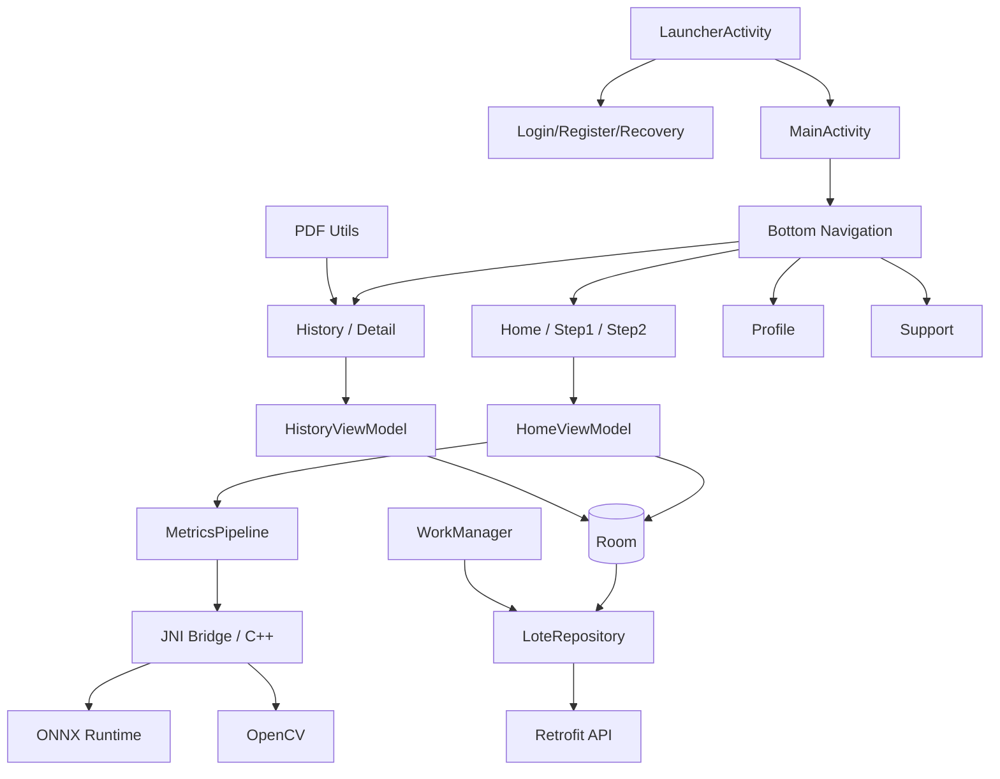

# Metrics Detection

Informe tecnico del proyecto Android **Metrics Detection**, una aplicacion
AgTech para captura de racimos, inferencia local de Computer Vision/ML,
persistencia local, historial, exportacion PDF y sincronizacion con backend.

Este README documenta lo confirmado por el codigo y por el build local. No
declara precision, latencia, rendimiento de campo ni seguridad criptografica
mas alla de lo observable en la implementacion.

## Descripcion del Proyecto

Metrics Detection permite:

- Iniciar sesion y enrutar al usuario autenticado.
- Crear un lote con company, vessel, block y variety.
- Capturar o seleccionar imagenes de racimos.
- Ejecutar inferencia local mediante pipeline Android + JNI/C++ + ONNX/OpenCV.
- Revisar resultados, imagenes y distribuciones visuales.
- Guardar lotes localmente en Room.
- Ver historial y detalle de lote.
- Exportar/compartir PDF.
- Sincronizar lotes con backend cuando hay conectividad.
- Gestionar perfil, almacenamiento local, modo oscuro y soporte.

## Arquitectura General



## Stack Android Confirmado

| Area | Tecnologia |
|---|---|
| Lenguaje | Kotlin 2.0.0, Java 8 bytecode |
| UI | XML Views, ViewBinding, Material Components 1.12.0, AppCompat |
| Navegacion | AndroidX Navigation Fragment/UI 2.7.7 |
| Layout | ConstraintLayout, CoordinatorLayout, ScrollView/NestedScrollView |
| Persistencia | Room 2.5.2 |
| Red | Retrofit 2.9.0, OkHttp 4.9.1/4.12.0, Gson |
| Background | WorkManager 2.7.1 |
| Imagenes | Glide 4.15.1, Android Photo Picker/GetContent, camara |
| Graficos | MPAndroidChart |
| PDF | `android.graphics.pdf.PdfDocument` |
| Seguridad local | AndroidX Security Crypto para `EncryptedSharedPreferences` |
| ML/CV | JNI/C++17, ONNX Runtime Android 1.24.3, OpenCV Android SDK |
| Build | Android Gradle Plugin 8.5.1, compileSdk 34, minSdk 28 |

## Flujo de Usuario

1. `LauncherActivity` decide si mostrar autenticacion o `MainActivity` segun
   `TokenProvider.isLoggedIn()`.
2. `LoginActivity` autentica contra backend y guarda sesion local.
3. `MainActivity` inicializa bottom navigation: Inicio, Historial, Perfil y
   Soporte.
4. En Inicio, `Step1Fragment` recolecta metadata del lote.
5. `Step2Fragment` permite crear racimos, capturar/cargar imagenes, revisar
   Frente/Reverso, procesar y guardar.
6. Historial lista lotes locales, permite filtrar, seleccionar, ver detalle y
   compartir PDF.
7. Perfil muestra datos de usuario y acciones de almacenamiento local.
8. Soporte muestra contacto y preguntas frecuentes.

## Flujo ML / Computer Vision

El flujo ML se documenta a nivel conceptual porque esta iteracion visual no
modifica JNI, C++, ONNX, OpenCV ni assets de modelos.

1. La app extrae modelos ONNX desde assets a almacenamiento interno en
   `MetricsDetectionApp`.
2. `HomeViewModel` coordina la preparacion de imagenes y llama al pipeline.
3. `MetricsPipeline` valida archivos de modelo y delega al puente nativo.
4. El codigo JNI/C++ ejecuta preprocesamiento, inferencia ONNX y operaciones
   OpenCV.
5. El resultado vuelve a Kotlin como datos de prediccion, histogramas, imagenes
   procesadas y metadata.
6. La UI muestra resumen, detalle, imagenes e histograma.

Modelos observados en assets:

- `weights/modelos/legacy/seg_best.onnx`
- `weights/modelos/qty_model_rgbdt.onnx`
- `weights/modelos/qty_model_rgbdt.onnx.data`
- `weights/modelos/hist_rgbdt_bimodal.onnx`
- `weights/modelos/hist_rgbdt_bimodal.onnx.data`

## UI/UX Actualizada

Primera iteracion visual segura aplicada:

- Radios unificados: cards principales `16dp`, cards internas `12dp`,
  botones `16dp`, inputs `16dp`, chips `12dp`.
- Tipografia existente ordenada: `roboto_medium.ttf` se usa en titulos de
  toolbar, titulos de pantalla y botones. Merriweather se conserva disponible,
  pero no se fuerza como cuerpo por riesgo de volver editorial una app tecnica.
- Registro y Recuperacion migrados a Material Components con
  `TextInputLayout`, `TextInputEditText`, `MaterialButton` y `MaterialCheckBox`.
- Spacing/padding normalizado con `spacing_xs/sm/md/lg`.
- Bottom navigation muestra labels y usa icono real de Home.
- Empty state de racimos usa texto claro: "Sin racimos todavia" y
  "Captura o selecciona imagenes para comenzar el analisis."
- Toolbars de Historial, Perfil, Soporte, Registro y Recuperacion quedan con
  apariencia consistente.
- Se movieron textos visibles de XML a `strings.xml`/`values-en/strings.xml`
  cuando era seguro.

## Responsividad

Ajustes aplicados para pantallas pequenas y telefonos estandar:

- Formularios de Registro y Recuperacion viven dentro de `ScrollView` con
  `fillViewport=true`.
- Inputs y botones conservan ancho flexible y `minHeight` tactil de 48dp.
- Bottom navigation aumenta altura para labels visibles.
- Filtros compactos de racimos evitan alturas fijas de 38dp.
- Accion de cierre en pantalla completa pasa a 48dp.
- Textos de botones y placeholders se mantienen desde recursos localizables.

Se realizo validacion runtime en emulador `Pixel_7` para Login, Registro,
Recuperacion, Crear lote, selector de variedad, galeria del sistema, seleccion
de imagen, carga Frente/Reverso, inferencia local, resultado resumen, Historial,
Perfil, Soporte y modo claro/oscuro. Quedan pendientes la validacion con teclado
abierto, orientacion si se habilita por feature flag, exportacion PDF recapturada
y sincronizacion real contra backend disponible.

## Color y Tema

La paleta revisada es coherente con AgTech + ML:

- Verde: marca, accion primaria, exito y agricultura.
- Azul: informacion tecnica/sistema.
- Rojo: error/destructivo.
- Amarillo/naranja: advertencias.
- Superficies claras/oscuras: `md_background`, `md_surface`,
  `md_surface_soft`, `md_surface_subtle`.

La app cuenta con `values/colors.xml`, `values-night/colors.xml`,
`values/themes.xml` y `values-night/themes.xml`. El modo oscuro se aplica con
`AppCompatDelegate` y preferencia local.

## Offline / Online

Confirmado por codigo:

- La inferencia se ejecuta localmente con modelos incluidos en assets.
- Room mantiene lotes locales.
- WorkManager programa sincronizacion periodica y manual cuando hay red.
- Retrofit/OkHttp comunican autenticacion, perfil y lotes con backend.
- `NetworkUtils` valida conectividad de interfaz, no disponibilidad real de un
  host remoto.

## Seguridad y Autenticacion

Confirmado por codigo:

- Login contra `auth/login`.
- Refresh token mediante `auth/refresh-token`.
- Logout contra `auth/logout`.
- Tokens y datos de sesion en `EncryptedSharedPreferences`.
- `allowBackup=false` en manifest.

No se documentan credenciales internas en este README publico.

## Capturas de Vistas

Documentacion completa de capturas:

- [vistas.md](vistas.md)

Capturas representativas:


## Archivos Principales

| Archivo | Rol |
|---|---|
| `app_metrics_detection/app/src/main/AndroidManifest.xml` | Permisos, activities, provider, theme |
| `app_metrics_detection/app/build.gradle.kts` | Configuracion Android, JNI, dependencias |
| `app_metrics_detection/app/src/main/java/com/gaiaspa/metrics_detection/LauncherActivity.kt` | Ruteo inicial auth/main |
| `app_metrics_detection/app/src/main/java/com/gaiaspa/metrics_detection/MainActivity.kt` | Host de navegacion y sync |
| `app_metrics_detection/app/src/main/java/com/gaiaspa/metrics_detection/auth/LoginActivity.kt` | Login |
| `app_metrics_detection/app/src/main/java/com/gaiaspa/metrics_detection/auth/RegisterActivity.kt` | Registro por invitacion |
| `app_metrics_detection/app/src/main/java/com/gaiaspa/metrics_detection/auth/RecoveryActivity.kt` | Recuperacion de contrasena |
| `app_metrics_detection/app/src/main/java/com/gaiaspa/metrics_detection/ui/home/HomeViewModel.kt` | Orquestacion de lote, imagenes e inferencia |
| `app_metrics_detection/app/src/main/java/com/gaiaspa/metrics_detection/ml/MetricsPipeline.kt` | Entrada Kotlin al pipeline ML |
| `app_metrics_detection/app/src/main/cpp/` | JNI/C++/OpenCV/ONNX |
| `app_metrics_detection/app/src/main/java/com/gaiaspa/metrics_detection/data/local/` | Room DB/DAO |
| `app_metrics_detection/app/src/main/java/com/gaiaspa/metrics_detection/network/` | Retrofit, tokens e interceptores |
| `app_metrics_detection/app/src/main/java/com/gaiaspa/metrics_detection/worker/` | WorkManager sync/download |
| `app_metrics_detection/app/src/main/res/layout/` | UI XML |
| `app_metrics_detection/app/src/main/res/values/` | Temas, colores, estilos, dimensiones y strings |

## Cambios Visuales Aplicados

| Area | Archivos |
|---|---|
| Radios/spacing/tipografia | `dimens.xml`, `styles.xml`, `themes.xml`, `values-night/themes.xml` |
| Registro | `activity_register.xml`, `strings.xml`, `values-en/strings.xml` |
| Recuperacion | `activity_recovery.xml`, `strings.xml`, `values-en/strings.xml` |
| Navegacion inferior | `activity_main.xml`, `menu_bottom_nav.xml` |
| Toolbars/empty states | `fragment_history.xml`, `fragment_step2.xml`, `fragment_support.xml`, `fragment_profile.xml` |
| Historial/detalle/items | `item_lote_history.xml`, `fragment_lote_detail.xml`, `item_image_prediction.xml`, `item_image_prediction_detail.xml` |
| Paneles visuales | `bg_histogram_panel.xml`, `bg_photo_panel.xml`, `bg_result_panel.xml` |

## Como Compilar

Desde el modulo Android:

```bash
cd app_metrics_detection
./gradlew assembleDebug
```

Requisitos esperados:

- Android SDK instalado y configurado en `local.properties`.
- Dependencias nativas presentes en `third_party/onnxruntime` y
  `third_party/opencv`.

## Como Ejecutar

Con dispositivo o emulador conectado:

```bash
cd app_metrics_detection
./gradlew installDebug
```

Luego abrir la app desde el launcher del dispositivo/emulador.

## Como Validar

Checklist recomendado:

- Login con credenciales internas de validacion.
- Crear lote con company/vessel/block/variety.
- Seleccionar imagen desde galeria.
- Capturar o cargar Frente/Reverso.
- Revisar resultado, imagenes e histograma.
- Guardar lote.
- Abrir Historial y Detalle de lote.
- Compartir PDF.
- Revisar Perfil, almacenamiento y Soporte.
- Revisar modo claro/oscuro.
- Revisar Registro y Recuperacion visualmente.

## Validacion Local Realizada

```bash
cd app_metrics_detection
./gradlew assembleDebug
```

Resultado: build debug exitoso.

Tambien se uso `adb devices` y se encontro el emulador `emulator-5554`
(`Pixel_7`). Se ejecuto `./gradlew installDebug`, se abrio la app, se inicio
sesion con credenciales internas de validacion, se seleccionaron imagenes reales
desde `imagenesparatest/` mediante el Photo Picker y se obtuvo resultado de
inferencia Frente/Reverso en modo claro y oscuro. Las capturas nuevas se
guardaron en `capturas_vistas_app_4/`.

## Riesgos Conocidos

- Existe una nueva serie de capturas en `capturas_vistas_app_4/`, documentada
  en `vistas.md`, con modo claro y oscuro.
- La inferencia Frente/Reverso fue ejecutada con imagenes de prueba, pero sus
  valores no son metricas experimentales de precision o performance.
- Exportacion PDF y sincronizacion backend quedan pendientes de validacion
  manual completa.
- Las metricas cuantitativas de precision, latencia y rendimiento quedan
  pendientes de validacion experimental.
- Algunas preferencias como selector de idioma y rotacion aparecen gateadas por
  feature flags.

## Pendientes

- Recapturar pantalla completa de imagen y hoja de compartir/exportar PDF en
  modo claro y oscuro.
- Validacion con teclado abierto en Registro/Recuperacion.
- Validacion de orientacion si se habilita la feature flag.
- Validacion de sincronizacion real contra backend disponible.

## Alcance Protegido

En esta iteracion visual no se modificaron:

- JNI/C++.
- ONNX/assets/modelos.
- Room/DAO/entities.
- Retrofit/API/network.
- WorkManager/sync.
- Pipeline ML.
- Package/applicationId.
- Navegacion critica.
