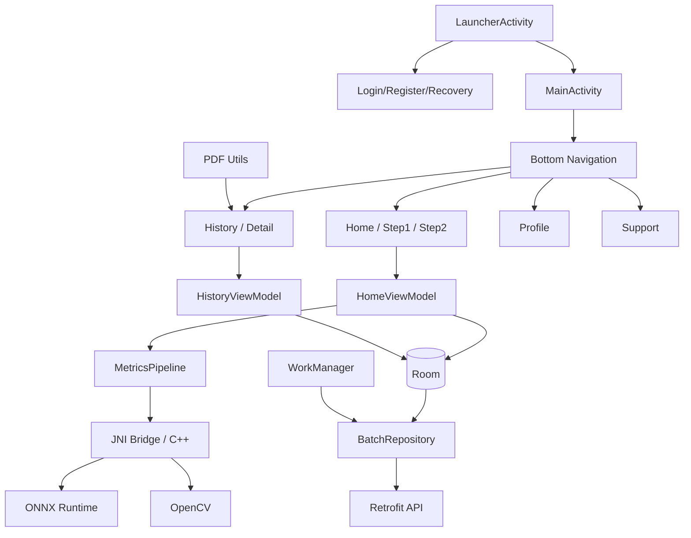

# Metrics Detection

## Public Academic Demo Status

The publishable Android project is in `app_metrics_detection/`. For the public
academic demonstration repository, default `debug` and `release` builds run with
`DEMO_MODE=true`: no username/password, no real login, no backend calls, no cloud
sync, and local-only saved records. Backend/auth/sync code is preserved for
private reactivation, but disabled in the public build configuration.

Technical report of the Android project **Metrics Detection**, an
AgTech application for bunch capture, local Computer Vision/ML inference,
local persistence, history, PDF export, and preserved backend synchronization
code that is disabled in the public academic demo build.

This README documents what has been confirmed by the code and local build. It does
not declare precision, latency, field performance, or cryptographic security
beyond what is observable in the implementation.

## Project Description

Metrics Detection enables:

- Demo routing directly to the local workflow; the preserved login flow is disabled in public `DEMO_MODE` builds.
- Creating a batch with company, vessel, block, and variety.
- Capturing or selecting bunch images.
- Running local inference via Android + JNI/C++ + ONNX/OpenCV pipeline.
- Reviewing results, images, and visual distributions.
- Saving batches locally in Room.
- Viewing history and batch detail.
- Exporting/sharing PDF.
- Preserved backend synchronization for private builds; disabled in public `DEMO_MODE` builds.
- Managing profile, local storage, dark mode, and support.

## General Architecture



## Confirmed Android Stack

| Area | Technology |
|---|---|
| Language | Kotlin 2.0.0, Java 8 bytecode |
| UI | XML Views, ViewBinding, Material Components 1.12.0, AppCompat |
| Navigation | AndroidX Navigation Fragment/UI 2.7.7 |
| Layout | ConstraintLayout, CoordinatorLayout, ScrollView/NestedScrollView |
| Persistence | Room 2.5.2 |
| Network | Retrofit 2.9.0, OkHttp 4.9.1/4.12.0, Gson |
| Background | WorkManager 2.7.1 |
| Images | Glide 4.15.1, Android Photo Picker/GetContent, camera |
| Charts | MPAndroidChart |
| PDF | `android.graphics.pdf.PdfDocument` |
| Local security | AndroidX Security Crypto for `EncryptedSharedPreferences` |
| ML/CV | JNI/C++17, ONNX Runtime Android 1.24.3, OpenCV Android SDK |
| Build | Android Gradle Plugin 8.5.1, compileSdk 34, minSdk 28 |

## User Flow

1. In public `DEMO_MODE` builds, `LauncherActivity` shows the academic agreement and then opens `MainActivity` without authentication.
2. In private non-demo builds, the preserved authentication flow can route through `LoginActivity`.
3. `MainActivity` initializes bottom navigation: Home, History, Profile, and
   Support.
4. In Home, `Step1Fragment` collects batch metadata.
5. `Step2Fragment` allows creating bunches, capturing/loading images, reviewing
   Front/Back, processing, and saving.
6. History lists local batches, allows filtering, selecting, viewing detail, and
   sharing PDF.
7. Profile displays user data and local storage actions.
8. Support shows contact information and FAQs.

## ML / Computer Vision Flow

The ML flow is documented at a conceptual level because this visual iteration does not
modify JNI, C++, ONNX, OpenCV, or model assets.

1. The app extracts ONNX models from assets to internal storage in
   `MetricsDetectionApp`.
2. `HomeViewModel` coordinates image preparation and calls the pipeline.
3. `MetricsPipeline` validates model files and delegates to the native bridge.
4. The JNI/C++ code runs preprocessing, ONNX inference, and OpenCV
   operations.
5. The result returns to Kotlin as prediction data, histograms, processed
   images, and metadata.
6. The UI displays summary, detail, images, and histogram.

Models observed in assets:

- `weights/models/legacy/seg_best.onnx`
- `weights/models/qty_model_rgbdt.onnx`
- `weights/models/qty_model_rgbdt.onnx.data`
- `weights/models/hist_rgbdt_bimodal.onnx`
- `weights/models/hist_rgbdt_bimodal.onnx.data`

## Updated UI/UX

First safe visual iteration applied:

- Unified border radii: main cards `16dp`, inner cards `12dp`,
  buttons `16dp`, inputs `16dp`, chips `12dp`.
- Existing typography organized: `roboto_medium.ttf` is used in toolbar
  titles, screen titles, and buttons. Merriweather is kept available,
  but not forced as body text to avoid making a technical app look editorial.
- Registration and Recovery migrated to Material Components with
  `TextInputLayout`, `TextInputEditText`, `MaterialButton`, and `MaterialCheckBox`.
- Spacing/padding normalized with `spacing_xs/sm/md/lg`.
- Bottom navigation shows labels and uses a real Home icon.
- Bunch empty state uses clear text: "No bunches yet" and
  "Capture or select images to begin analysis."
- History, Profile, Support, Registration, and Recovery toolbars have
  consistent appearance.
- Visible text moved from XML to `strings.xml`/`values-en/strings.xml`
  when safe.

## Responsiveness

Adjustments applied for small screens and standard phones:

- Registration and Recovery forms live inside `ScrollView` with
  `fillViewport=true`.
- Inputs and buttons retain flexible width and a touch `minHeight` of 48dp.
- Bottom navigation increases height for visible labels.
- Compact bunch filters avoid fixed heights of 38dp.
- Full-screen close action increased to 48dp.
- Button texts and placeholders are kept from localizable resources.

Runtime validation was performed on `Pixel_7` emulator for Login, Registration,
Recovery, Create batch, variety selector, system gallery, image
selection, Front/Back loading, local inference, result summary, History,
Profile, Support, and light/dark mode. Pending: validation with keyboard
open, orientation if enabled by feature flag, re-captured PDF export,
and real sync against available backend.

## Color and Theme

The revised palette is consistent with AgTech + ML:

- Green: brand, primary action, success, and agriculture.
- Blue: technical/system information.
- Red: error/destructive.
- Yellow/orange: warnings.
- Light/dark surfaces: `md_background`, `md_surface`,
  `md_surface_soft`, `md_surface_subtle`.

The app has `values/colors.xml`, `values-night/colors.xml`,
`values/themes.xml`, and `values-night/themes.xml`. Dark mode is applied with
`AppCompatDelegate` and local preference.

## Offline / Online

Confirmed by code:

- Inference runs locally with models included in assets.
- Room keeps local batches.
- WorkManager schedules periodic and manual sync when network is available.
- Retrofit/OkHttp handle authentication, profile, and batches with backend.
- `NetworkUtils` validates interface connectivity, not real host
  availability.

## Security and Authentication

Confirmed by code:

- Login against `auth/login`.
- Token refresh via `auth/refresh-token`.
- Logout against `auth/logout`.
- Tokens and session data in `EncryptedSharedPreferences`.
- `allowBackup=false` in manifest.

No internal credentials are documented in this public README.

## View Screenshots

Complete screenshot documentation:

- [vistas.md](vistas.md)

Representative screenshots:


## Main Files

| File | Role |
|---|---|
| `app_metrics_detection/app/src/main/AndroidManifest.xml` | Permissions, activities, provider, theme |
| `app_metrics_detection/app/build.gradle.kts` | Android config, JNI, dependencies |
| `app_metrics_detection/app/src/main/java/com/gaiaspa/metrics_detection/LauncherActivity.kt` | Initial auth/main routing |
| `app_metrics_detection/app/src/main/java/com/gaiaspa/metrics_detection/MainActivity.kt` | Navigation and sync host |
| `app_metrics_detection/app/src/main/java/com/gaiaspa/metrics_detection/auth/LoginActivity.kt` | Login |
| `app_metrics_detection/app/src/main/java/com/gaiaspa/metrics_detection/auth/RegisterActivity.kt` | Invitation-based registration |
| `app_metrics_detection/app/src/main/java/com/gaiaspa/metrics_detection/auth/RecoveryActivity.kt` | Password recovery |
| `app_metrics_detection/app/src/main/java/com/gaiaspa/metrics_detection/ui/home/HomeViewModel.kt` | Batch, image, and inference orchestration |
| `app_metrics_detection/app/src/main/java/com/gaiaspa/metrics_detection/ml/MetricsPipeline.kt` | Kotlin entry point to ML pipeline |
| `app_metrics_detection/app/src/main/cpp/` | JNI/C++/OpenCV/ONNX |
| `app_metrics_detection/app/src/main/java/com/gaiaspa/metrics_detection/data/local/` | Room DB/DAO |
| `app_metrics_detection/app/src/main/java/com/gaiaspa/metrics_detection/network/` | Retrofit, tokens, and interceptors |
| `app_metrics_detection/app/src/main/java/com/gaiaspa/metrics_detection/worker/` | WorkManager sync/download |
| `app_metrics_detection/app/src/main/res/layout/` | UI XML |
| `app_metrics_detection/app/src/main/res/values/` | Themes, colors, styles, dimensions, and strings |

## Visual Changes Applied

| Area | Files |
|---|---|
| Borders/spacing/typography | `dimens.xml`, `styles.xml`, `themes.xml`, `values-night/themes.xml` |
| Registration | `activity_register.xml`, `strings.xml`, `values-en/strings.xml` |
| Recovery | `activity_recovery.xml`, `strings.xml`, `values-en/strings.xml` |
| Bottom navigation | `activity_main.xml`, `menu_bottom_nav.xml` |
| Toolbars/empty states | `fragment_history.xml`, `fragment_step2.xml`, `fragment_support.xml`, `fragment_profile.xml` |
| History/detail/items | `item_lote_history.xml`, `fragment_lote_detail.xml`, `item_image_prediction.xml`, `item_image_prediction_detail.xml` |
| Visual panels | `bg_histogram_panel.xml`, `bg_photo_panel.xml`, `bg_result_panel.xml` |

## How to Build

From the Android module:

```bash
cd app_metrics_detection
./gradlew assembleDebug
```

Expected requirements:

- Android SDK installed and configured in `local.properties`.
- Native dependencies present in `third_party/onnxruntime` and
  `third_party/opencv`.

## How to Run

With a connected device or emulator:

```bash
cd app_metrics_detection
./gradlew installDebug
```

Then open the app from the device/emulator launcher.

## How to Validate

Recommended checklist:

- Login with internal validation credentials.
- Create a batch with company/vessel/block/variety.
- Select an image from the gallery.
- Capture or load Front/Back.
- Review result, images, and histogram.
- Save batch.
- Open History and Batch Detail.
- Share PDF.
- Review Profile, storage, and Support.
- Review light/dark mode.
- Review Registration and Recovery visually.

## Local Validation Performed

```bash
cd app_metrics_detection
./gradlew assembleDebug
```

Result: debug build successful.

`adb devices` was also used and the `emulator-5554` emulator (`Pixel_7`) was found.
`./gradlew installDebug` was run, the app was opened, login
was performed with internal validation credentials, real images were selected
from `imagenesparatest/` via the Photo Picker, and Front/Back inference
results were obtained in light and dark mode. New screenshots were
saved in `capturas_vistas_app_4/`.

## Known Risks

- There is a new series of screenshots in `capturas_vistas_app_4/`, documented
  in `vistas.md`, with light and dark mode.
- Front/Back inference was run with test images, but its
  values are not experimental precision or performance metrics.
- PDF export and backend sync remain pending full manual
  validation.
- Quantitative precision, latency, and performance metrics remain
  pending experimental validation.
- Some preferences such as language selector and rotation appear gated by
  feature flags.

## Pending

- Re-capture full-screen image and PDF share/export sheet in
  light and dark mode.
- Validation with keyboard open in Registration/Recovery.
- Orientation validation if the feature flag is enabled.
- Real sync validation against available backend.

## Visual Overlay — Parallel Pipeline Architecture

### Strict separation

The overlay system operates as a **parallel visual pipeline** fully
independent from the production pipeline:

| Pipeline | Purpose | Files |
|----------|---------|-------|
| **Production** | ONNX inference, count (QTY), histogram (HIST), RGBDT features, distance transform, predictive JSON | `grape_pipeline_core.cpp`, `grape_pipeline_preprocess.cpp`, `grape_pipeline_onnx.cpp` |
| **Parallel visual** | Visual mask construction, overlay rendering, centroids, layers, and colors | `grape_pipeline_postprocess.cpp`, `grape_pipeline_config.hpp` (namespace `overlay_visual`) |

The production pipeline **was not modified**. The visual pipeline reads the segmentation
data (`SegmentationOutput`) produced by the production pipeline
but never modifies `count_total`, `pred[]`, `mean`, `mode`, `std`,
`seg_count_base`, `detections[]`, `hist_prob`, or any business metric.

### Visual pipeline modules

| Function | Role |
|----------|------|
| `RecomputeLetterboxParams()` | Recomputes letterbox ratio/dw/dh from original and model dimensions |
| `CleanMaskForOverlay()` | Post-processes binary masks: threshold, morph close, Gaussian blur, soft threshold |
| `MapMaskToCanvas()` | Maps mask from letterbox space (`_lb`) or original (`_orig`) to the final canvas |
| `BuildCombinedBunchGrapeMaskForOverlay()` | Builds visual mask joining bunch + grape (`_orig` first, `_lb` with reverse-letterbox as fallback) |
| `BuildGlobalPingpongMaskForOverlay()` | Builds visual pingpong mask with proper reverse-letterbox |
| `ComputeVisualCentroid()` | Computes centroid via `cv::moments` with `boundingRect` fallback |
| `DrawFilledCentroid()` | Draws centroid with dark border for contrast |
| `RenderVisualOverlayLayers()` | Master render: applies fill, contours, and centroids in correct order |
| `SaveVisualOverlay()` | Orchestrator: reads base image, builds masks, renders, saves |

### Reverse-letterbox visual

Masks exist in two spaces:
- `_orig`: already mapped to the original image size (computed in `RunSegmentationPipeline()` via `ScaleMaskBackToOriginal()`)
- `_lb`: in letterbox space 512x512

The visual pipeline **prefers `_orig`** (guaranteed correct mapping). If only
`_lb` masks exist, it applies `ScaleMaskBackToOriginal()` with the recomputed
letterbox parameters (`ratio`, `dw`, `dh`). Direct resize is no longer used.

### Render order

```
1. Original image (background)
2. Soft fill bunch+grape  (cyan, alpha 0.10)
3. Pingpong fill            (orange, alpha 0.25)
4. Pingpong outline         (yellow, dynamic thickness)
5. Centroids                (bunch/grape reddish-orange, pingpong blue)
6. Outer contour bunch+grape (cyan, simplified approxPolyDP, dynamic thickness)
```

### Visual colors (BGR)

| Element | Color | BGR |
|----------|-------|-----|
| Fill bunch+grape | Soft cyan | (255, 255, 0) |
| Contour bunch+grape | Cyan | (255, 255, 0) |
| Fill pingpong | Orange | (0, 220, 255) |
| Contour pingpong | Yellow | (0, 255, 255) |
| Centroid bunch/grape | Red-orange | (0, 80, 255) |
| Centroid pingpong | Blue | (255, 80, 0) |

Constants defined in `grape_pipeline_config.hpp`, namespace `overlay_visual`.

### Dynamic parameters

Contour thicknesses and centroid radii are calculated proportionally
to image width to adapt to different resolutions:

- Bunch+grape contour: `max(3, min(5, cols / 300))`
- Pingpong contour:    `max(2, min(4, cols / 420))`
- Bunch/grape centroid: `max(2, min(4, cols / 350))`
- Pingpong centroid:    `max(3, min(5, cols / 320))`

### Diagnostic logs

```
OVERLAY_DIAG canvas=WxH bunch_grape_nonzero=N pingpong_nonzero=N centroids=N contours=N
```

### Visual constants vs production

All visual pipeline constants are in `namespace overlay_visual`
within `grape_pipeline_config.hpp`. They are independent and do not replace
`kDefaultSegConfThreshold`, `kDefaultSegMaskThreshold`, `kCaliberMinMm`,
`kCaliberMaxMm`, or any production pipeline constant.

### No-impact validation

- `count_total`, `pred[]`, `mean`, `mode`, `std` are not modified.
- `seg_count_base`, `detections[]` are read but not altered.
- `PipelineResultToJson()` does not change.
- `SaveDebugArtifacts()` does not change its production logic.
- `GrapePipelineCore::Run()` only calls `SaveVisualOverlay()`; its signature and
  production behavior do not change.

## Protected Scope

In this iteration the following were not modified:

- JNI/C++ (except visual overlay in postprocess.cpp and visual-only constants in config.hpp).
- ONNX/assets/models.
- Room/DAO/entities.
- Retrofit/API/network.
- WorkManager/sync.
- Production ML pipeline (thresholds, NMS, count, histogram, predictions, RGBDT, distance transform).
- Package/applicationId.
- Critical navigation.
