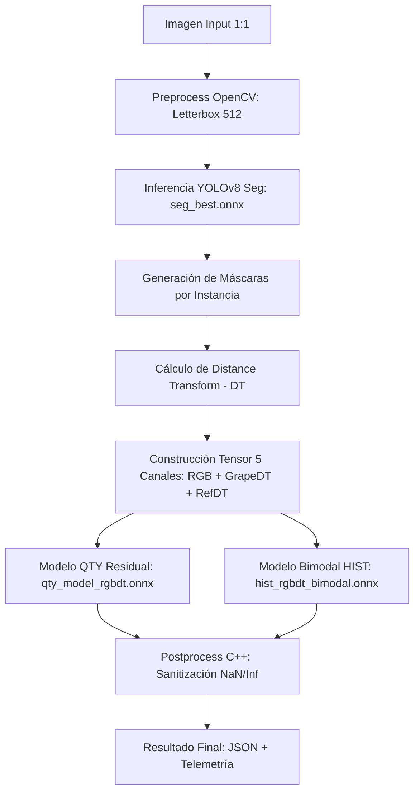

# 📱 Metrics Detection - AI Viticulture Pipeline (v7.0)

Sistema avanzado de **visión artificial en el borde (Edge AI)** de grado industrial para la industria vitivinícola. Combina un motor nativo C++ optimizado con modelos de Deep Learning RGBDT para la segmentación y análisis de calibres de uvas en tiempo real directamente en dispositivos Android.

---

## 🏛️ 1. Arquitectura y Flujo de Datos

El sistema utiliza una arquitectura híbrida que delega la carga computacional pesada a C++ (JNI) para garantizar latencias mínimas y estabilidad, mientras que Kotlin gestiona la UI, persistencia y sincronización.

### Pipeline de Procesamiento RGBDT (5 Canales)

---

## 📊 2. Evaluación del Sistema (Auditoría Forense)

Basado en el último run masivo (**run_20260417_010324**) con **296 muestras** reales de campo, el sistema ha sido validado contra Ground Truth (CSV) obteniendo los siguientes resultados de ingeniería:

### Métricas Globales
| Métrica | Valor | Interpretación Técnica |
| :--- | :--- | :--- |
| **MAE** | **5.01** | Error Absoluto Medio. Desviación promedio de ±5 granos por racimo. |
| **Bias** | **-1.27** | Sesgo sistemático. Indica una tendencia leve a la subestimación. |
| **Inflation** | **0.978x** | Factor de corrección. El regresor es conservador ante oclusiones. |
| **Fidelity** | **91.2%** | Cercanía porcentual al Ground Truth. **Apto para Pre-producción.** |

### Desempeño por Variedad (Top & Bottom)
| Variedad | MAE | Estado | Insight de Campo |
| :--- | :--- | :--- | :--- |
| **MAGENTA** | **2.32** | 🏆 Excelente | Estructura de racimo abierta; paridad casi total. |
| **SWEET GLOBE** | **3.24** | ✅ Óptimo | Alta estabilidad en la detección de referencia. |
| **AUTUMN CRISP** | **3.52** | ✅ Óptimo | Muy buena respuesta del modelo de 5 canales. |
| **SUPERIOR** | **6.72** | ⚠️ Crítico | Racimos densos; alta dependencia del regresor residual. |
| **IVORY** | **8.08** | ❌ Crítico | Bajo contraste color/fondo; requiere ajuste de threshold. |

---

## ⚙️ 3. Capacidades de Procesamiento y Operación

### Gestión de Lotes (Batch)
- **Capacidad por Tirada:** Testeado con éxito hasta **300 fotos continuas**.
- **Caché Singleton (RAM):** Los modelos ONNX se mantienen cargados en memoria.
  - *Primera foto:* ~2.5s (Carga de pesos).
  - *Siguientes:* ~900ms (Inferencia pura).
- **Eficiencia Térmica:** Monitoreo de **Throttling**. Si el dispositivo se calienta, el sistema ajusta la carga para evitar crashes.

---

## 🔐 4. Seguridad, Sesión y Optimización

### Multi-tenant Invisible
El sistema está alineado con un backend corporativo NestJS. El `companyId` se resuelve automáticamente vía JWT; la App no decide el tenant, garantizando aislamiento total de datos.

### Protección de Código (ProGuard/R8)
Se aplica en la etapa de **Build Release** (`./gradlew assembleRelease`):
- **Ofuscación:** Protege la lógica de negocio y algoritmos propietarios.
- **Optimización JNI:** Preserva las interfaces nativas y evita la eliminación de métodos usados por C++.
- **Compatibilidad:** Mantiene las clases de `ai.onnxruntime` para asegurar el acceso a NPU/GPU.

---

## 🧪 5. Motor de Validación Forense

El proyecto incluye un set de herramientas para asegurar la paridad de resultados con el modelo de investigación:
- **Test Batch**: `./imagenesparatest/run_kotlin_emulator_batch.ps1` (Automatización en emulador).
- **Auditoría**: `./imagenesparatest/eval_jni_vs_gt.py` (Reportes de MAE, EMD/W1 y Estabilidad de Calibración).

---

## 🛠️ 6. Tecnologías y Librerías

- **Android/Kotlin:** ViewBinding, WorkManager (Offline-First), EncryptedSharedPreferences.
- **Nativo (C++17):** OpenCV, ONNX Runtime (NNAPI Support).
- **Red:** Retrofit2 con DTOs seguros y timeouts extendidos (300s).

---
© 2026 Gaia Robotics - Viticulture Intelligence Team
