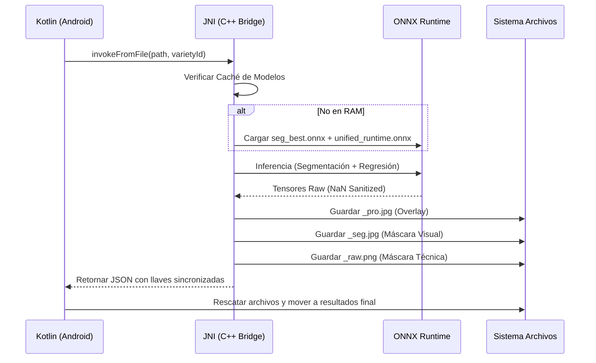

# 🧪 Manual de Auditoría Forense - Metrics Detection

Este documento explica el flujo técnico del motor JNI y cómo interpretar los resultados generados por cada análisis de imagen.

## 🔄 Flujo de Procesamiento (v6.0)

El sistema utiliza un Singleton en C++ para mantener los modelos ONNX en RAM y procesar imágenes en milisegundos.

## 📂 Guía de Archivos Resultantes

Por cada foto analizada, el sistema genera:

1.  **`{nombre}.json`**: Datos estadísticos (`mean`, `mode`, `std`) y array `detections` con cada uva encontrada.
2.  **`{nombre}_pro.jpg`**: Overlay visual con los bordes de detección (Verde para uvas, Rojo para otros).
3.  **`{nombre}_seg.jpg`**: Máscara coloreada para inspección rápida de calidad de segmentación.
4.  **`{nombre}_raw.png`**: **Máscara Binaria Pura (0/255)**. Este es el archivo que debe usar el script de Python para validación técnica.

## 📊 Criterios de Validación

El script de evaluación (`eval_jni_vs_gt.py`) utiliza los siguientes KPIs:
- **Fidelidad General**: Capacidad del modelo para acercarse al conteo manual.
- **W1 Distance (EMD)**: Precisión de la curva de tamaños (mm).
- **SegBase vs GT**: Para detectar si el fallo es del segmentador o del regresor.

---
© 2026 Gaia Robotics - Equipo de Optimización de Uvas
