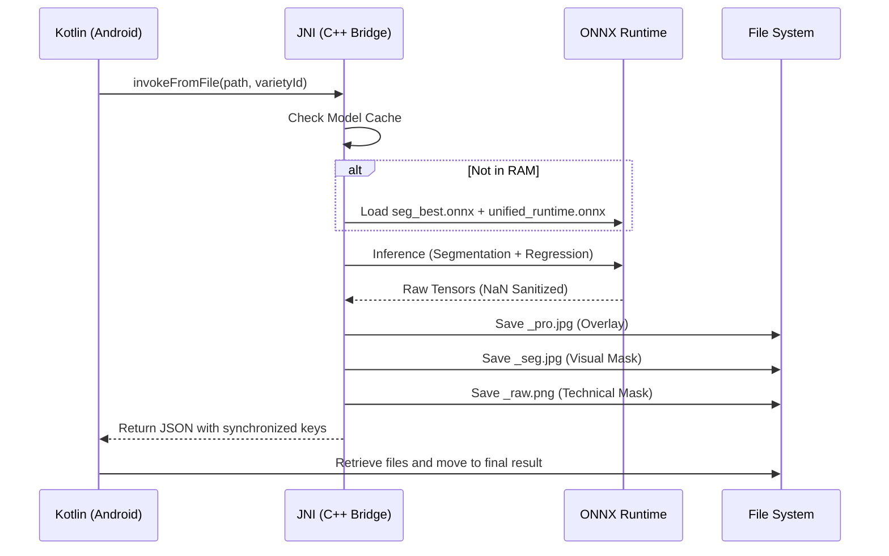

# 🧪 Forensic Audit Manual - Metrics Detection

This document explains the technical flow of the JNI engine and how to interpret the results generated by each image analysis.

## 🔄 Processing Flow (v6.0)

The system uses a C++ Singleton to keep ONNX models in RAM and process images in milliseconds.

## 📂 Result File Guide

For each analyzed photo, the system generates:

1.  **`{name}.json`**: Statistical data (`mean`, `mode`, `std`) and `detections` array with each grape found.
2.  **`{name}_pro.jpg`**: Visual overlay with detection borders (Green for grapes, Red for others).
3.  **`{name}_seg.jpg`**: Colored mask for quick segmentation quality inspection.
4.  **`{name}_raw.png`**: **Pure Binary Mask (0/255)**. This is the file the Python script should use for technical validation.

## 📊 Validation Criteria

The evaluation script (`eval_jni_vs_gt.py`) uses the following KPIs:
- **Overall Fidelity**: Model's ability to approach the manual count.
- **W1 Distance (EMD)**: Precision of the size curve (mm).
- **SegBase vs GT**: To detect whether the failure is in the segmenter or the regressor.

---
© 2026 Gaia Robotics - Grape Optimization Team
