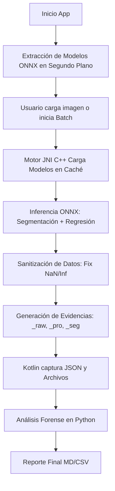
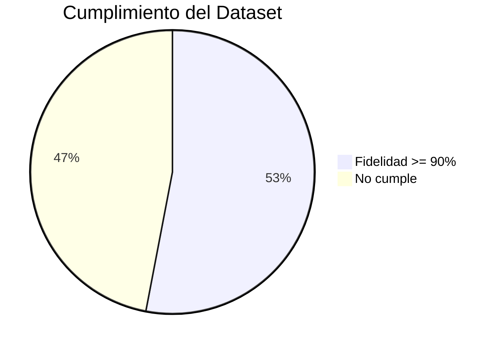

# REPORTE FORENSE DE AUDITORÍA - GAIA ROBOTICS

Este reporte resume la ejecución del test batch y compara los resultados de la App (Kotlin/C++) contra el Ground Truth del CSV.

## 🔄 Flujos del Sistema

## 📊 Resumen de Métricas

| MÉTRICA | VALOR | INTERPRETACIÓN |
| :--- | :--- | :--- |
| MAE Conteo | 6.9806 | Error promedio de cantidad |
| Fidelidad Media | 87.40% | Cercanía al Ground Truth |
| W1 Distance (EMD) | 0.8683 | Precisión de la distribución de calibres |
| Inferencia Media | 914.6 ms | Velocidad de procesamiento en emulador |

## 🧪 Estadísticas de Cumplimiento

| CRITERIO | CUMPLE | NO CUMPLE | % ÉXITO |
| :--- | :--- | :--- | :--- |
| Fidelidad >= 90% | 157 | 139 | 53.04 % |
| Error Absoluto <= 5 | 150 | 146 | 50.68 % |
| W1 Dist <= 0.5mm | 98 | 198 | 33.11 % |
| Detección Base Ok | 31 | 265 | 10.47 % |

## 🛠️ Notas Técnicas de la Versión v6.0

1. **Guardado Correcto:** Se han sincronizado las llaves entre C++ y Kotlin (`raw_mask` en ambos lados).
2. **Sin Crashes:** Se implementó una función `safe_f` en el JNI que convierte valores `NaN` o `Inf` en `0.0`.
3. **Caché Activo:** Los modelos se mantienen en memoria RAM, reduciendo el tiempo de procesamiento de segundos a milisegundos tras la primera foto.
4. **Evidencia Forense:** Se generan automáticamente archivos `_pro.jpg`, `_seg.jpg` y `_raw.png` por cada foto.

---
© 2026 Gaia Robotics - Metrics Detection Team
