# 🍇 Grape Bunch Analysis App — Visual Walkthrough

> A step-by-step tour of the offline-first Android application for on-device grape bunch analysis.  
> Each screen is explained with its purpose, user interaction, and role in the overall pipeline.

---

## Table of Contents

1. [Academic Agreement](#1-academic-agreement)
2. [Demo Login](#2-demo-login)
3. [Batch Creation](#3-batch-creation)
4. [Image Capture (A/B Pairs)](#4-image-capture-ab-pairs)
5. [On-Device Inference](#5-on-device-inference)
6. [Results & Measurement](#6-results--measurement)
7. [History, Profile & Support](#7-history-profile--support)

---

## 1. Academic Agreement

The app opens with an **academic agreement** screen. This is a mandatory step that informs the user about the research purpose of the application and requires explicit consent.

### 1a. Initial Launcher / Agreement

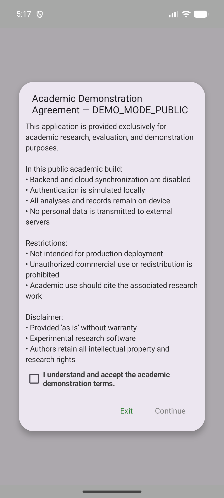

**What you see:** The app's splash/launcher transitions into the academic agreement screen. A scrollable text describes the research context, data usage, and offline-only nature of the demo.

**User action:** Read the agreement text.

**App section:** `AgreementActivity` — this is the first activity shown on every cold start. The agreement is session-only (never persisted), ensuring the user is informed every time.

---

### 1b. Agreement Accepted


**What you see:** A checkbox below the agreement text. Once checked, the **Continue** button becomes enabled (previously grayed out).

**User action:** Tap the checkbox, then tap **Continue**.

**App section:** `AgreementActivity` — the Continue button is bound to a boolean state that toggles with the checkbox. This is a simple consent gate before entering the app.

---

### 1c. After Agreement

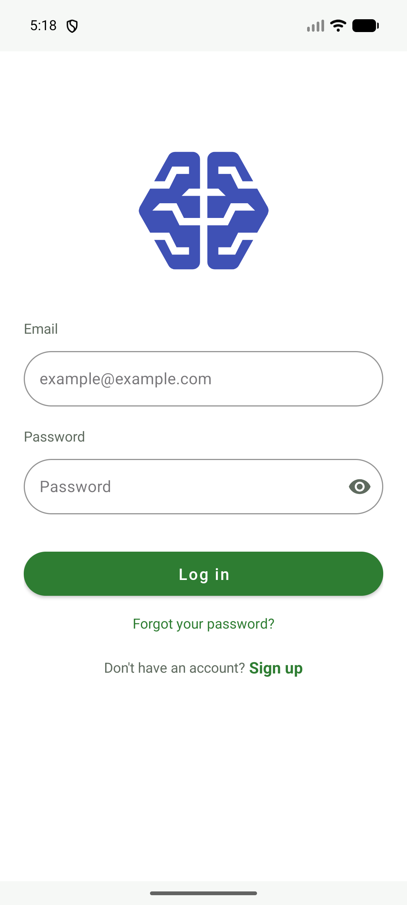


**What you see:** The home/batch screen immediately after accepting the agreement. This is the main entry point of the app.

**App section:** The app navigates from `AgreementActivity` to the main `HomeActivity` / batch creation screen.

---

## 2. Demo Login

After the agreement, the app shows a **login screen**. However, with `DEMO_MODE=true`, authentication is intercepted locally — no backend call is made.

### 2a. Login Screen


**What you see:** Email and password text fields with a **Login** button below. This is a real login UI, preserved for demonstration purposes.

**User action:** Tap the **Login** button (any credentials work in demo mode).

**App section:** `LoginActivity` / `DemoAuthInterceptor` — the login UI is real, but the `AuthInterceptor` checks `DEMO_MODE` and bypasses any server call. A local token is generated instead.

---

### 2b. Login Interaction

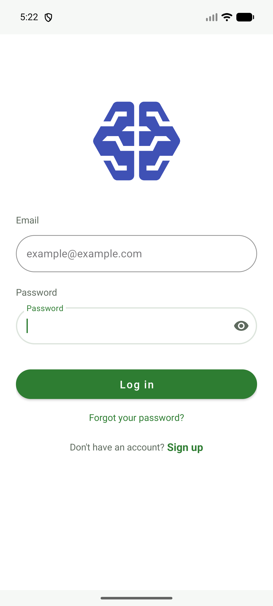
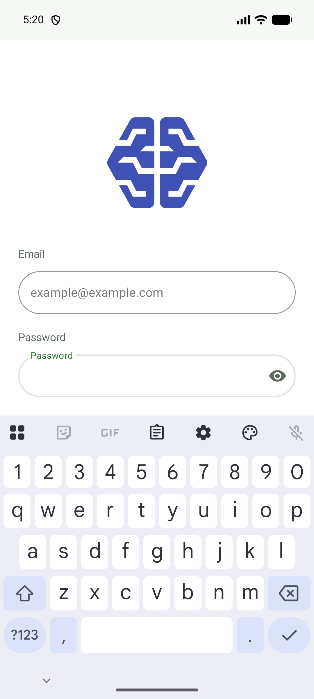
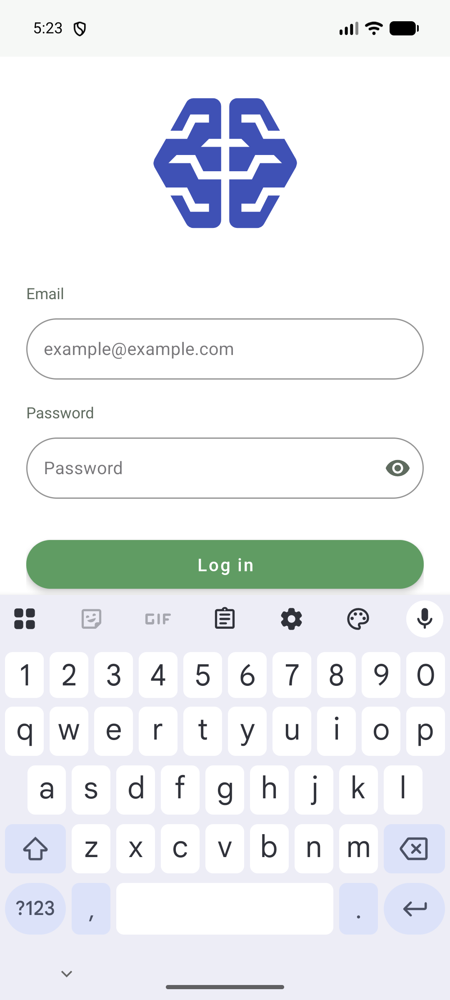
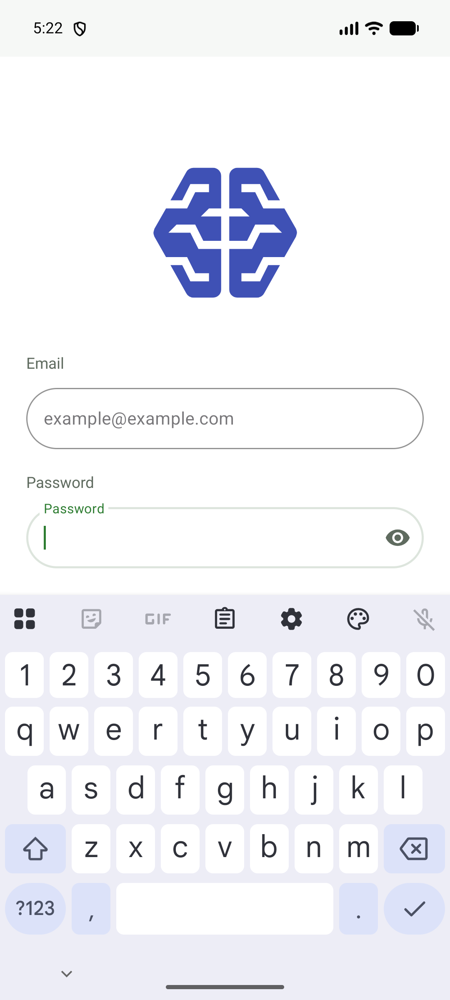


**What you see:** Various states of the login interaction — keyboard shown/dismissed, credentials being entered, and the moment the login button is tapped.

**User action:** Type any email/password (or leave blank) and tap **Login**.

**App section:** `LoginViewModel` + `DemoAuthInterceptor` — the ViewModel calls the auth repository, which detects demo mode and returns a success response with a local demo token immediately.

---

### 2c. Post-Login / Home

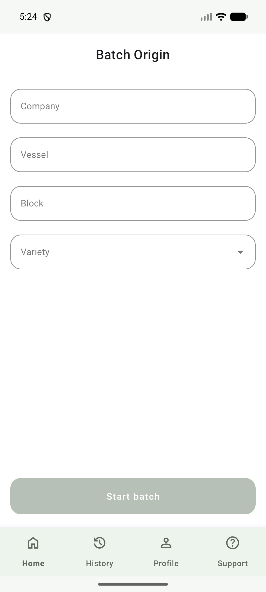
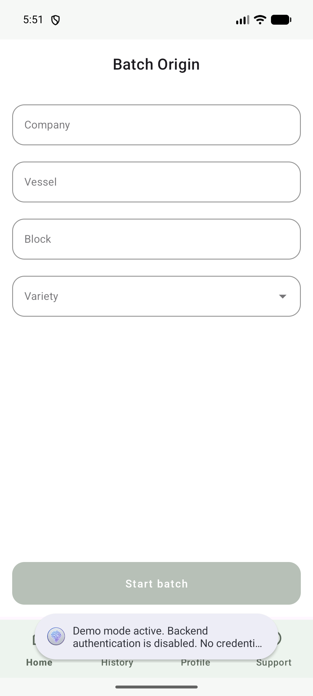

**What you see:** The main home screen after successful demo login. The user is now authenticated locally and can start creating batches.

**App section:** `HomeActivity` / `BatchOriginFragment` — the main hub for batch creation. From here the user navigates to the capture flow.

---

## 3. Batch Creation

A **batch** represents a single grape bunch analysis session. The user fills in metadata about the batch before capturing images.

### 3a. Batch Form (Blank)


**What you see:** A form with fields for batch metadata — variety, field, grower, and other optional details. The **Start Batch** button is disabled until required fields are filled.

**User action:** Tap the variety selector or type in field details.

**App section:** `BatchOriginFragment` — the form is backed by a ViewModel that validates required fields before enabling the start button.

---

### 3b. Variety Selector

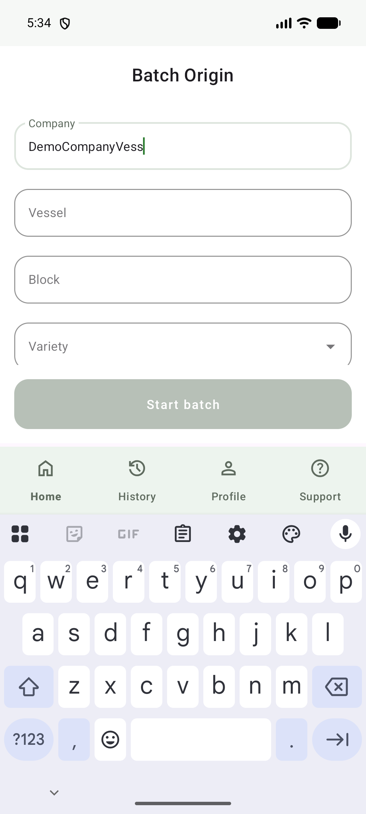
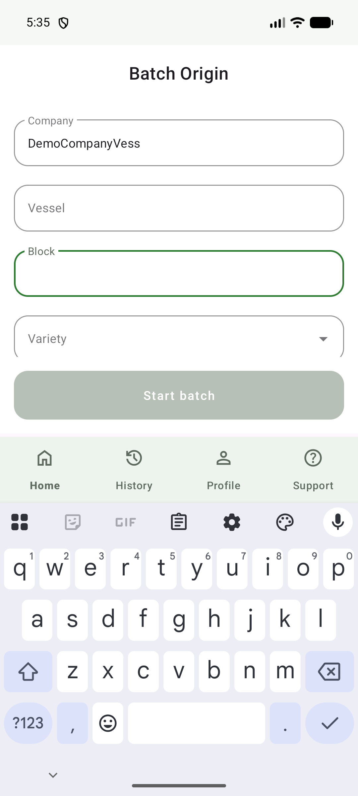
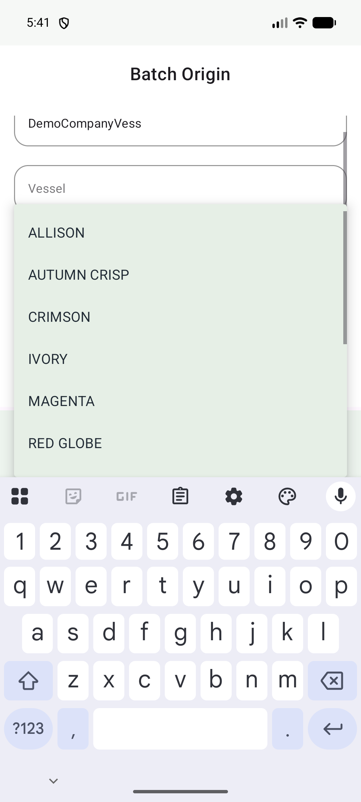


**What you see:** The variety selector is a dropdown with a list of table-grape varieties (e.g., Scarlotta, Allison, Autumn Crisp, Thompson, Crimson, etc.). The form can also accept free-text input for field and grower.

**User action:** Select a variety from the dropdown, optionally fill other fields, then tap **Start Batch**.

**App section:** `BatchOriginFragment` + variety list from the app's data layer. The 12 supported varieties mirror those in the research paper's evaluation dataset.

---

### 3c. Batch Started

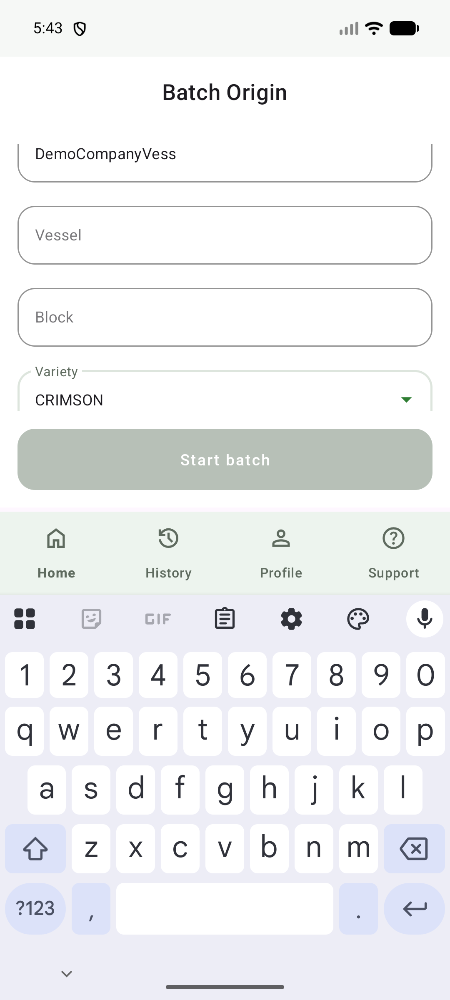

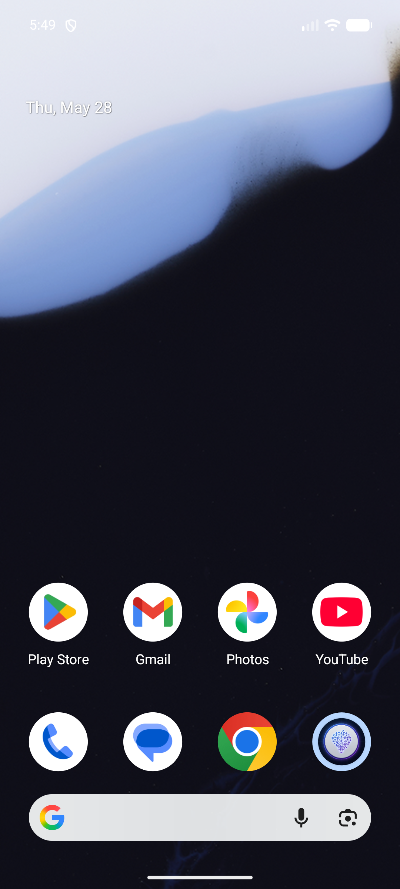


**What you see:** The batch is created and the app transitions to the **capture screen**. A confirmation may appear indicating the batch is ready.

**App section:** The `CaptureActivity` or equivalent fragment is launched. A new batch record is inserted into the local Room (SQLite) database with status `IN_PROGRESS`.

---

## 4. Image Capture (A/B Pairs)

The core of the app's data collection: capture **two images per bunch** (Side A / Side B) for multi-view fusion.

### 4a. First Capture (Side A)


**What you see:** The camera/gallery interface after capturing the **first image** (Side A / Front view). A thumbnail preview is shown.

**User action:** Capture or select the first image using the device camera or gallery picker.

**App section:** `CaptureFragment` — supports both camera (via CameraX or similar) and gallery selection. The image is stored temporarily for the pair.

---

### 4b. Second Capture (Side B)


**What you see:** After capturing the **second image** (Side B / Back view). Both thumbnails are now visible, indicating a complete A/B pair ready for processing.

**User action:** Capture or select the second image. Once both sides are captured, the **Process** button becomes available.

**App section:** `CaptureFragment` — the pair state is tracked in the ViewModel. When both images are loaded, the UI enables the inference trigger.

---

## 5. On-Device Inference

The captured images are processed entirely on-device using ONNX Runtime and OpenCV via JNI/C++.

### Processing / Inference Running


**What you see:** A loading/progress indicator while the app runs the inference pipeline. The user waits for results.

**What happens under the hood:**

```
Kotlin (MetricsPipeline)
    ↓ JNI call
C++ (nativeRunPipeline)
    ↓ OpenCV preprocess (resize, normalize, RGBDT)
    ↓ ONNX Runtime inference (seg_best → qty_rgbdt → hist_rgbdt_bimodal)
    ↓ Postprocess (quantity, statistics, histogram)
    ↓ JNI return
Kotlin (result handling)
```

**App section:** `MetricsPipeline` (Kotlin) → JNI → `nativeRunPipeline` (C++) → ONNX Runtime. Models are memory-mapped from internal storage (`filesDir/weights/`). No GPU delegate — inference runs on CPU.

**Duration:** ~271 ms per single image, ~541 ms per fused A/B pair (measured on Xiaomi 13T).

---

## 6. Results & Measurement

### Result Detail Screen


**What you see:** The inference result with predicted metrics:
- **Berry count** (from quantity regression model)
- **Mean diameter** (from histogram model)
- **Standard deviation**, **mode**, and **size distribution**
- A histogram visualization of caliber distribution

**User action:** Review the results, then choose to **Save** the batch or discard.

**App section:** `ResultFragment` / `DetailActivity` — displays the output of the fusion pipeline. The result is a `Predict` object persisted via Room if saved.

**A/B fusion:** When both A and B images are processed, `FusionEngine` averages quantities, statistics, and histograms. A disagreement metric is computed per pair as a quality indicator.

---

## 7. History, Profile & Support

### 7a. History Screen

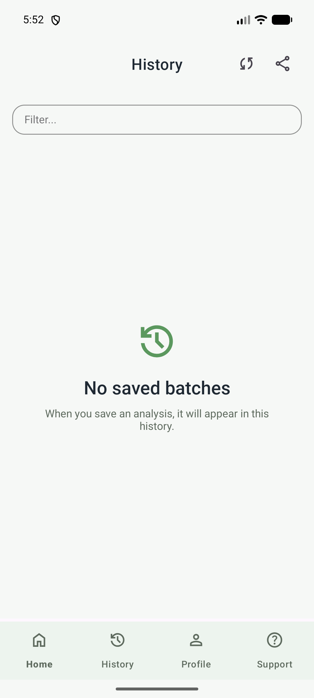

**What you see:** A list of previously saved batches. In this capture, the history is **empty** (no batches saved yet).

**User action:** Tap a saved batch to view its details or export a PDF report.

**App section:** `HistoryFragment` + `LoteDao` (Room) — queries saved batches from the local SQLite database. Supports viewing past results and generating PDF reports via Android's print/sharing framework.

---

### 7b. Profile Screen

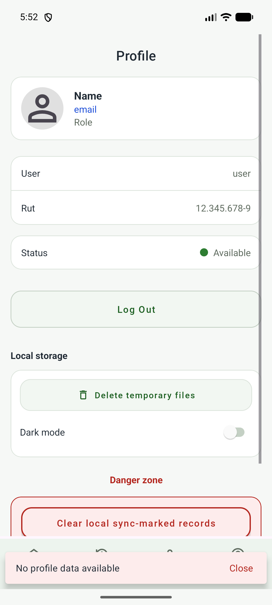

**What you see:** User profile and local settings — researcher name, institution, and app preferences.

**User action:** View or update profile information (local only, not synced in demo mode).

**App section:** `ProfileFragment` — manages local user metadata. In production mode this would sync with the backend; in `DEMO_MODE` it is purely local.

---

### 7c. Support Screen

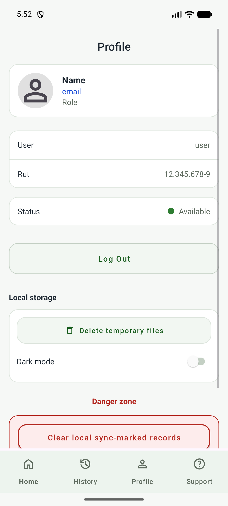

**What you see:** Contact information, FAQ, and links to the research documentation.

**User action:** Read support information or contact the research team.

**App section:** `SupportFragment` — static content with institutional contact details and paper references.

---

## Pipeline Overview

```
┌────────────────────────────────────────────────────────────────────────────┐
│                         USER FLOW (visual walkthrough)                      │
├────────────────────────────────────────────────────────────────────────────┤
│                                                                             │
│  AGREEMENT ──→ LOGIN ──→ BATCH FORM ──→ CAPTURE A ──→ CAPTURE B ──→       │
│   (01-03)      (04-08)     (09-13)        (17)          (18)               │
│                                                                             │
│  ┌─────────────────────────────────────────────────────────────────────┐   │
│  │                     ON-DEVICE INFERENCE                              │   │
│  │  seg_best.onnx ─→ qty_rgbdt.onnx ─→ hist_rgbdt_bimodal.onnx ─→     │   │
│  │  Segmentation     Quantity Reg.      Histogram / Caliber            │   │
│  └─────────────────────────────────────────────────────────────────────┘   │
│                                                                             │
│  RESULTS ──→ SAVE ──→ HISTORY ──→ PDF EXPORT                               │
│   (20)              (23)                                                    │
│                                                                             │
└────────────────────────────────────────────────────────────────────────────┘
```

---

## Key Takeaways

| Screen | What it does | Tech |
|--------|-------------|------|
| **Agreement** | Academic consent gate | `AgreementActivity` |
| **Login** | Demo authentication bypass | `DemoAuthInterceptor` |
| **Batch Form** | Metadata capture (variety, etc.) | `BatchOriginFragment` + Room |
| **A/B Capture** | Two-image pair for fusion | `CaptureFragment` |
| **Inference** | ONNX Runtime via JNI/C++ | `MetricsPipeline` + ONNX Runtime + OpenCV |
| **Results** | Berry count, diameter, histogram | `FusionEngine` |
| **History** | Saved batches from local DB | `LoteDao` (Room) |
| **Profile** | Local user settings | `ProfileFragment` |
| **Support** | FAQ and contact | `SupportFragment` |

---

## Gallery Image Pairs (A/B Selection Strategy)

```
A (Front view)                    B (Back view)
┌──────────────┐                 ┌──────────────┐
│   pair1_A    │                 │   pair1_B    │
│  (Scarlotta) │    +    ──►     │  (Scarlotta) │
└──────────────┘                 └──────────────┘

┌──────────────┐                 ┌──────────────┐
│   pair2_A    │                 │   pair2_B    │
│   (Allison)  │    +    ──►     │   (Allison)  │
└──────────────┘                 └──────────────┘
```

**Strategy:** Select A/B pairs (front/back views of the same bunch) for efficient neural fusion. The model correlates dual-view inputs to improve prediction accuracy.

---

*Last updated: 2026-05-28*  
*Part of: [grape-berry-estimation-demo-v2](https://github.com/Maxbarrioslopez/grape-berry-estimation-demo-v2)*
