# 🍇 Grape Bunch Analysis App — Visual Walkthrough

> A step-by-step tour of the offline-first Android application for on-device grape bunch analysis.  
> Each screen is explained with its purpose, user interaction, and role in the overall pipeline.

---

## Table of Contents

1. [Academic Agreement](#1-academic-agreement)
2. [Demo Login & Registration](#2-demo-login--registration)
3. [Batch Creation](#3-batch-creation)
4. [Image Capture & Processing](#4-image-capture--processing)
5. [Results & Metrics](#5-results--metrics)
6. [Save & History](#6-save--history)
7. [Profile & Support](#7-profile--support)

---

## 1. Academic Agreement

The app opens with an **academic agreement** pop-up. This mandatory step informs the user about the research purpose of the application and requires explicit consent before entering the app.

### 1a. Agreement Pop-up


**What you see:** A modal dialog with the academic agreement text — research context, data usage, offline-only nature, and institutional disclaimers.

**User action:** Read the agreement and tap the acceptance checkbox.

**App section:** `AgreementActivity` — shown on every cold start. The agreement is session-only (never persisted), ensuring the user is informed each time.

---

### 1b. Terms Accepted

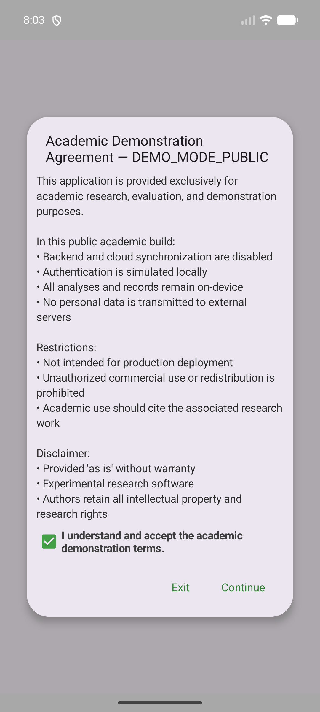

**What you see:** The checkbox is checked and the **Continue** button is now enabled. The dialog is ready to dismiss.

**User action:** Tap **Continue** to proceed.

**App section:** The Continue button is gated on the checkbox state. Once accepted, the app navigates to the login screen.

---

## 2. Demo Login & Registration

After the agreement, the app shows a **login screen**. With `DEMO_MODE=true`, authentication is intercepted locally — no backend call is made. The registration and password recovery UIs are preserved for demonstration.

### 2a. Login Screen (Demo Mode)


**What you see:** Email and password fields with a **Login** button. Below there are links to **Register** and **Forgot Password**.

**User action:** Tap **Login** directly (any credentials work), or explore Register / Forgot Password.

**App section:** `LoginActivity` — the UI is real. The `DemoAuthInterceptor` detects `DEMO_MODE=true` and returns a local success without any server call.

---

### 2b. Registration — Step 1 (Invitation)

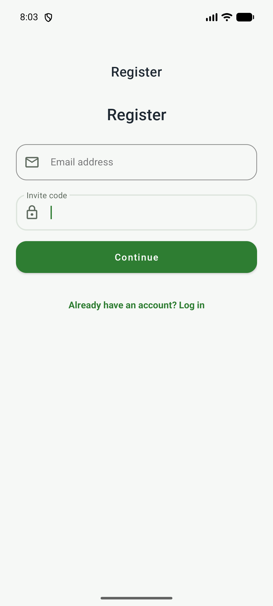

**What you see:** Registration form, first step — email field and invitation code field. A **Continue** button at the bottom.

**User action:** Fill in an email and invitation code (or leave defaults), tap **Continue**.

**App section:** `RegisterActivity` step 1 — the registration flow is split into multiple steps for data collection.

---

### 2c. Registration — Step 2 (Personal Data)

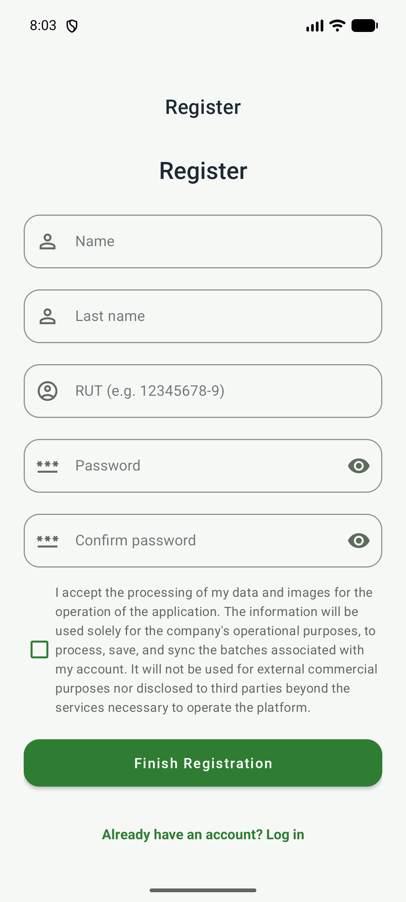

**What you see:** Second registration step — name, institution, password fields, plus data consent checkbox.

**User action:** Fill in the fields and tap **Register**.

**App section:** `RegisterActivity` step 2 — personal data and consent collection. In demo mode this is stored locally only.

---

### 2d. Return to Login from Registration


**What you see:** The app returns to the login screen after completing (or canceling) the registration flow.

**User action:** Tap **Login** to enter the app, or use the **Forgot Password** link if needed.

---

### 2e. Password Recovery

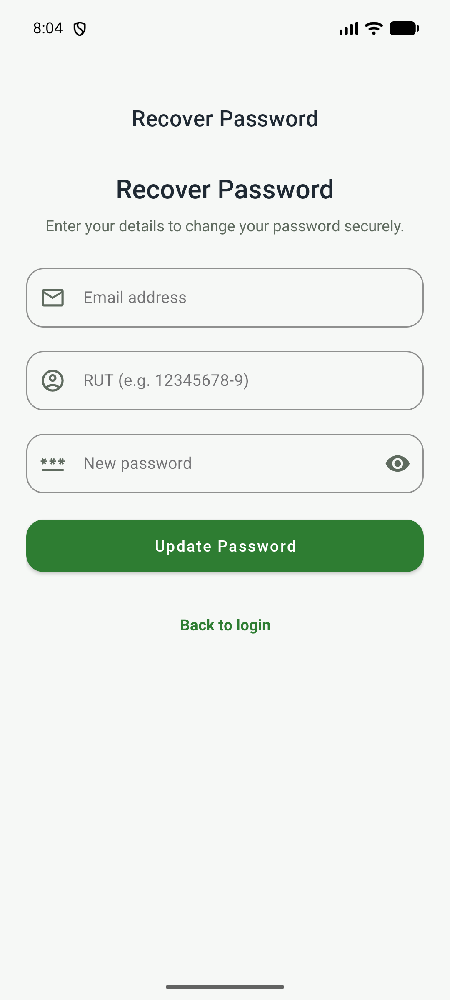

**What you see:** The password recovery screen with an email field. The user can request a password reset link.

**User action:** Enter an email address and tap the recovery button (in demo mode this is a local-only simulation).

**App section:** `RecoveryActivity` — password reset UI preserved for demonstration. The demo interceptor returns a simulated success.

---

### 2f. Login Before Entering

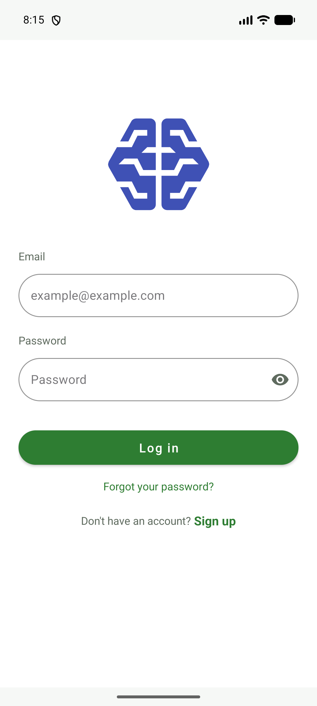

**What you see:** The login screen ready to submit — the user has entered credentials and is about to tap **Login**.

**User action:** Tap **Login** to authenticate and enter the main application.

---

## 3. Batch Creation

A **batch** represents a single grape bunch analysis session. The user fills in metadata about the bunch before capturing images.

### 3a. Empty Batch Form


**What you see:** The batch creation form with fields for variety, field, grower, and notes. The action button is disabled until required fields are completed.

**User action:** Tap the variety selector or type in field details.

**App section:** `BatchOriginFragment` — the form is backed by a ViewModel that validates required fields before enabling submission.

---

### 3b. Variety Selector Open

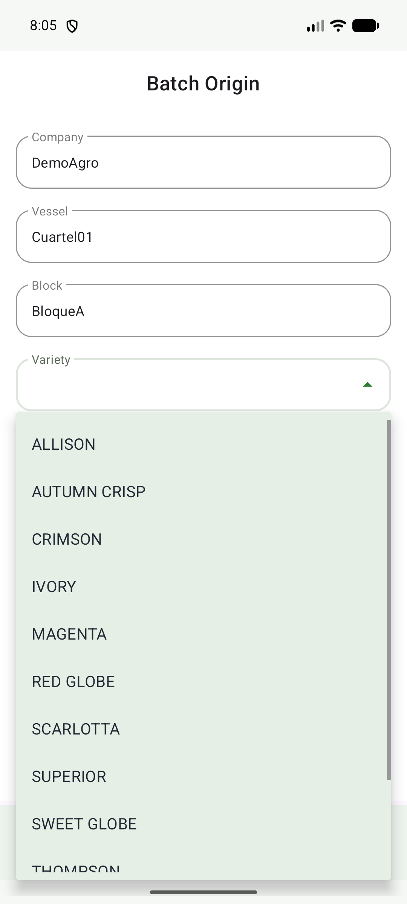

**What you see:** The variety dropdown is expanded, showing a list of table-grape varieties (e.g., Scarlotta, Allison, Autumn Crisp, Crimson, Timco, etc.).

**User action:** Scroll and tap a variety to select it.

**App section:** The variety list is populated from the app's data layer. The 12 supported varieties match those in the research paper's evaluation dataset.

---

### 3c. Complete Batch Form

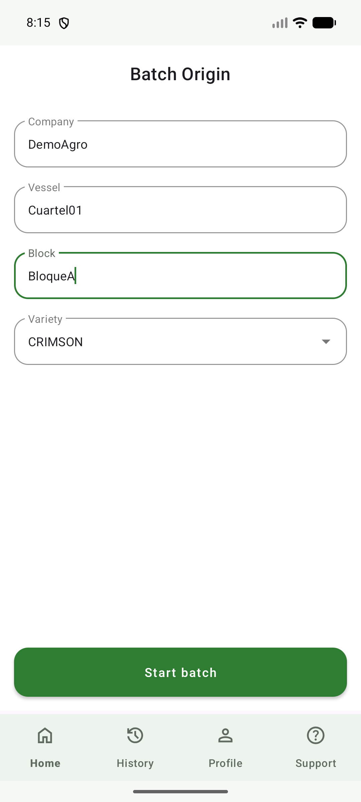

**What you see:** The batch form is fully filled — variety selected, field and grower entered. The **Start Batch** button is now enabled.

**User action:** Review the metadata and tap **Start Batch** to begin the capture process.

---

## 4. Image Capture & Processing

The core of the app's data pipeline: capture or select images for on-device inference.

### 4a. Process Screen — No Photos Yet

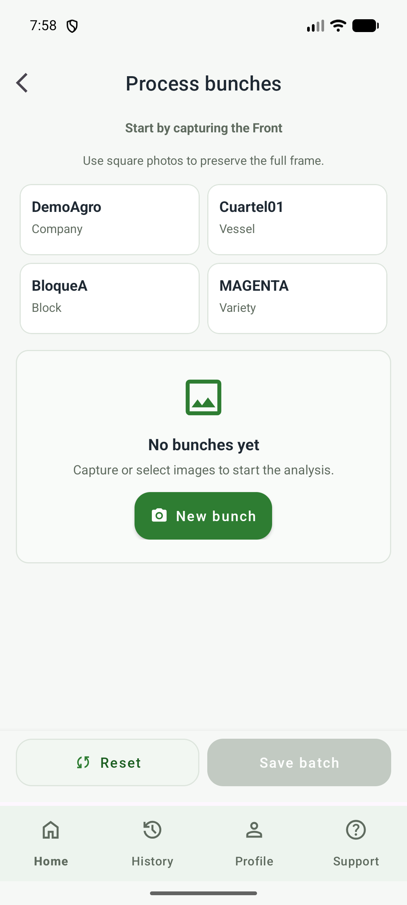

**What you see:** The processing screen for a batch before any images are loaded. Placeholder areas indicate where photos (Side A / Side B) will appear.

**User action:** Tap the **Camera** or **Gallery** button to add the first image (Side A / Front view).

**App section:** `CaptureFragment` — supports both camera (via CameraX) and gallery selection.

---

### 4b. Select Photo Source

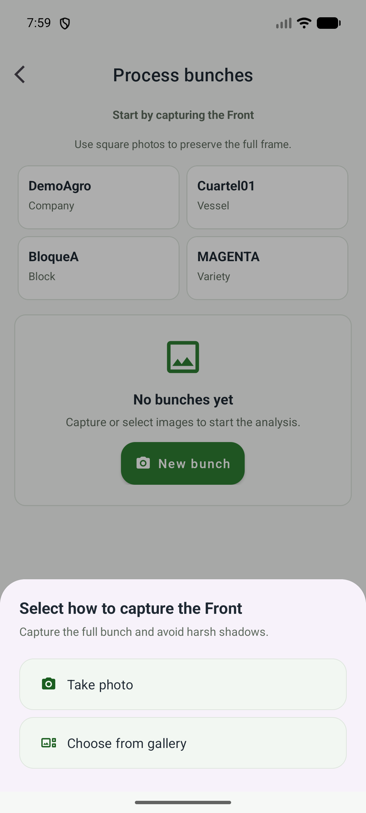

**What you see:** A dialog asking the user to choose between **Camera** and **Gallery** for the front view image.

**User action:** Tap **Gallery** (or **Camera** if using the device camera).

**App section:** Android `Intent` chooser — the app delegates image capture to the system camera or a gallery picker.

---

### 4c. Gallery with Image Selected

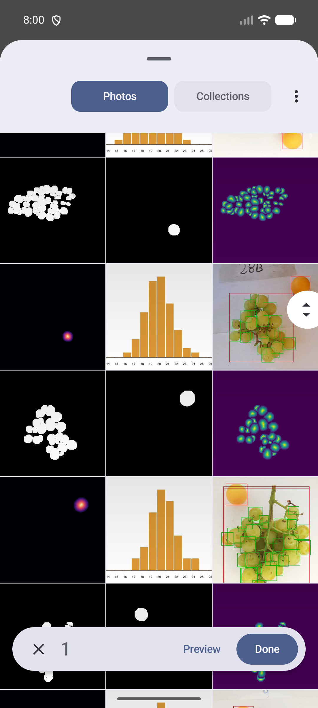

**What you see:** The emulator's gallery app with a test grape bunch image selected and ready to return to the app.

**User action:** Confirm the selection to return the image to the app.

---

### 4d. Result — Complete Bunch


**What you see:** The inference result with the grape bunch image displayed. Predicted berry count, mean diameter, and other metrics are shown on-screen.

**What happens under the hood:**

```
Kotlin (MetricsPipeline)
    ↓ JNI call
C++ (nativeRunPipeline)
    ↓ OpenCV preprocess (resize, normalize, RGBDT)
    ↓ ONNX Runtime inference (seg_best → qty_rgbdt → hist_rgbdt_bimodal)
    ↓ Postprocess (quantity, statistics, histogram, overlay)
    ↓ JNI return
Kotlin (result handling)
```

**App section:** `MetricsPipeline` (Kotlin) → JNI → `nativeRunPipeline` (C++) → ONNX Runtime. Models run on CPU only — no GPU delegate required.

---

## 5. Results & Metrics

### 5a. Detailed Metrics

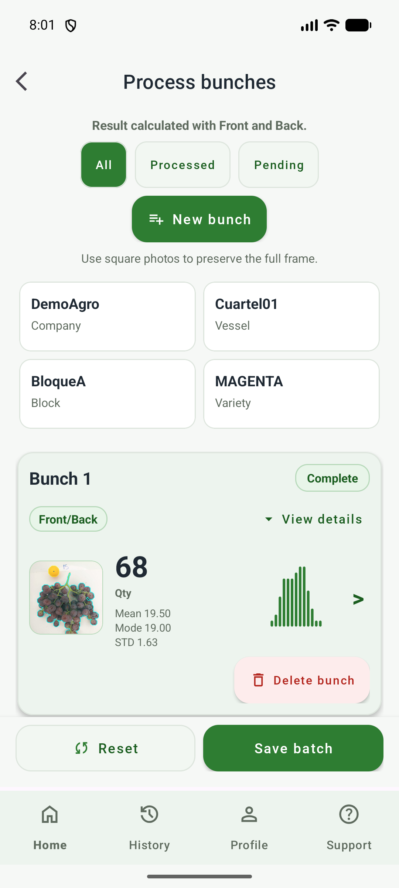

**What you see:** A scrollable detail view with the full inference output:
- **Estimated berry count**
- **Mean diameter** (mm)
- **Standard deviation**
- **Mode** (most frequent caliber)
- **Caliber distribution histogram**

**User action:** Review the metrics. The **Save** button persists the batch to the local database.

**App section:** `ResultFragment` / `DetailActivity` — displays the output of the fusion pipeline. The result is a `Predict` object persisted via Room if saved.

---

### 5b. Confirm Save

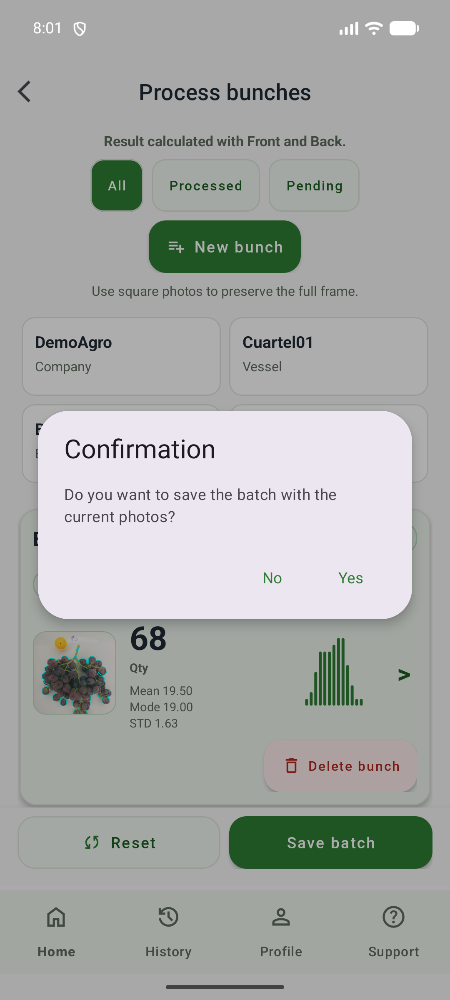

**What you see:** A confirmation dialog asking whether to save the batch with its results.

**User action:** Tap **Save** to persist the batch, or **Discard** to abandon it.

**App section:** The save action inserts the batch (`Lote`) and prediction (`Predict`) records into the local Room (SQLite) database.

---

## 6. Save & History

### 6a. Batch Saved — Form Reset

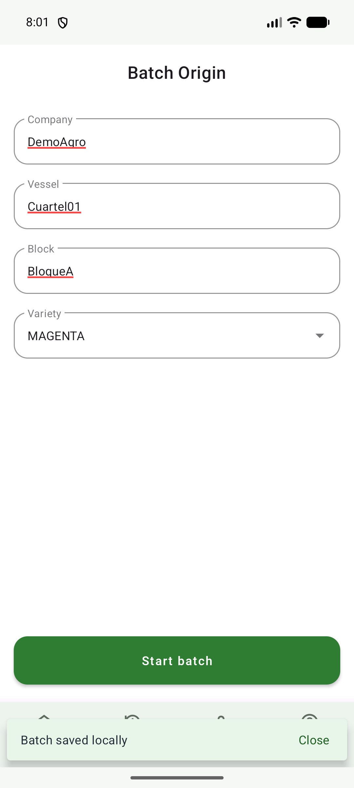

**What you see:** After saving, the batch form is reset to its empty state, ready for a new batch. The app is prepared for the next analysis session.

**User action:** Start a new batch or navigate to the history screen.

**App section:** The ViewModel clears the previous batch state and resets the form.

---

### 6b. History — Saved Batches List

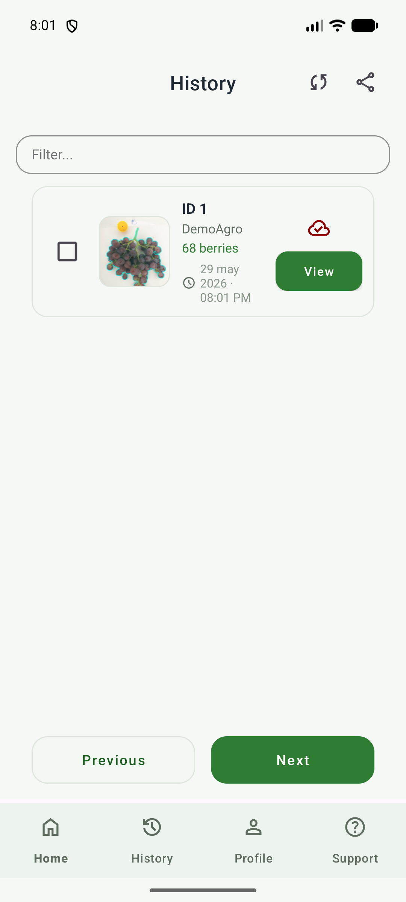

**What you see:** The history screen showing a list of previously saved batches. Each entry displays the date, variety, and measured berry count.

**User action:** Tap a batch to view its full details and metrics.

**App section:** `HistoryFragment` + `LoteDao` (Room) — queries saved batches from the local SQLite database, ordered by date.

---

### 6c. History — Batch Detail

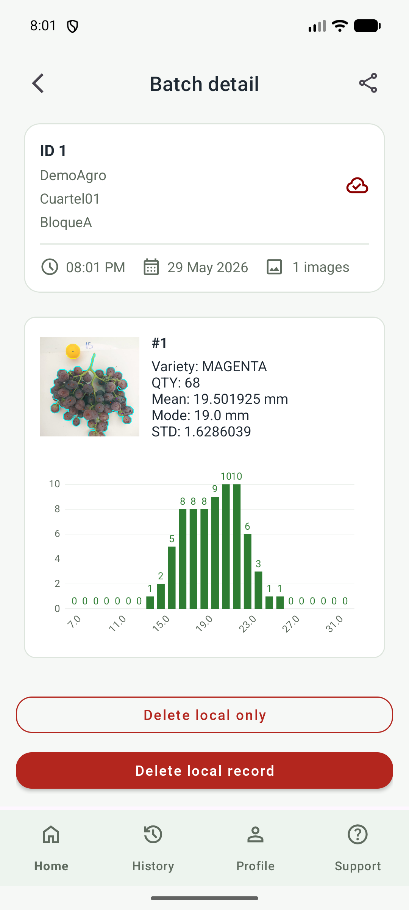

**What you see:** The full detail view of a saved batch — all metrics, images, and metadata from the original analysis.

**User action:** Review past results, compare across batches, or generate a PDF report.

**App section:** `DetailActivity` — reads the saved `Lote` and `Predict` records from Room and displays them.

---

## 7. Profile & Support

### 7a. Demo User Profile

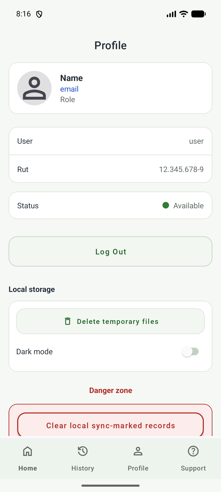

**What you see:** The user profile screen with local settings — researcher name, institution, email, and app preferences.

**User action:** View or update profile information (local only, not synced in demo mode).

**App section:** `ProfileFragment` — manages local user metadata. In production mode, this would sync with the backend.

---

### 7b. Support Center

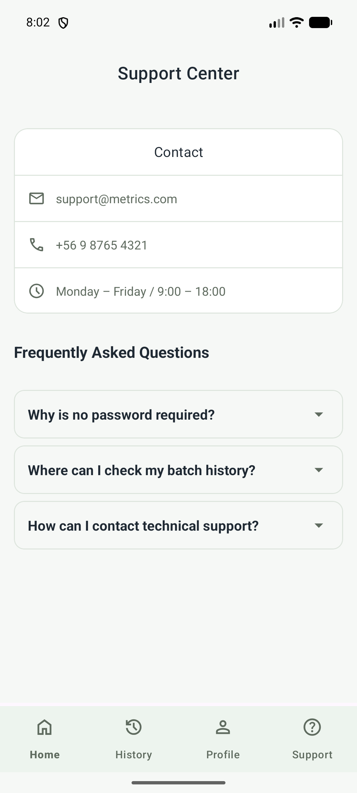

**What you see:** The support screen with contact information, FAQ links, and institutional references.

**User action:** Read support information or contact the research team.

**App section:** `SupportFragment` — static content with institutional contact details and paper references.

---

## Pipeline Overview

```
┌────────────────────────────────────────────────────────────────────────────┐
│                         USER FLOW (visual walkthrough)                      │
├────────────────────────────────────────────────────────────────────────────┤
│                                                                             │
│  AGREEMENT ──→ LOGIN ──→ BATCH FORM ──→ CAPTURE ──→ INFERENCE ──→         │
│   (01-02)      (03-08)     (09-11)        (12-14)     (15-16)             │
│                                                                             │
│  ┌─────────────────────────────────────────────────────────────────────┐   │
│  │                     ON-DEVICE INFERENCE                              │   │
│  │  seg_best.onnx ─→ qty_rgbdt.onnx ─→ hist_rgbdt_bimodal.onnx ─→     │   │
│  │  Segmentation     Quantity Reg.      Histogram / Caliber            │   │
│  └─────────────────────────────────────────────────────────────────────┘   │
│                                                                             │
│  RESULTS ──→ SAVE ──→ HISTORY ──→ PDF EXPORT                               │
│   (15-17)      (18)      (19-20)                                            │
│                                                                             │
└────────────────────────────────────────────────────────────────────────────┘
```

---

## Key Takeaways

| Screen | What it does | Tech |
|--------|-------------|------|
| **Agreement** (01-02) | Academic consent gate | `AgreementActivity` |
| **Login/Register** (03-08) | Demo auth (all routes preserved) | `LoginActivity`, `DemoAuthInterceptor`, `RegisterActivity`, `RecoveryActivity` |
| **Batch Form** (09-11) | Metadata capture (variety, field, grower) | `BatchOriginFragment` + Room |
| **Capture** (12-14) | Image selection (camera or gallery) | `CaptureFragment` |
| **Inference** (15-16) | ONNX Runtime via JNI/C++ | `MetricsPipeline` + ONNX Runtime + OpenCV |
| **Results** (15-17) | Berry count, diameter, histogram | `FusionEngine` |
| **History** (19-20) | Saved batches from local DB | `LoteDao` (Room) |
| **Profile** (21) | Local user settings | `ProfileFragment` |
| **Support** (22) | FAQ and contact | `SupportFragment` |

---

## Gallery Image Pairs (A/B Selection Strategy)

```
A (Front view)                    B (Back view)
┌──────────────┐                 ┌──────────────┐
│   pair1_A    │                 │   pair1_B    │
│  (Scarlotta) │    +    ──►     │  (Scarlotta) │
└──────────────┘                 └──────────────┘

┌──────────────┐                 ┌──────────────┐
│   pair2_A    │                 │   pair2_B    │
│   (Allison)  │    +    ──►     │   (Allison)  │
└──────────────┘                 └──────────────┘
```

**Strategy:** Select A/B pairs (front/back views of the same bunch) for efficient neural fusion. The model correlates dual-view inputs to improve prediction accuracy.

---

*Last updated: 2026-05-28*  
*Part of: [grape-berry-estimation-demo-v2](https://github.com/Maxbarrioslopez/grape-berry-estimation-demo-v2)*
